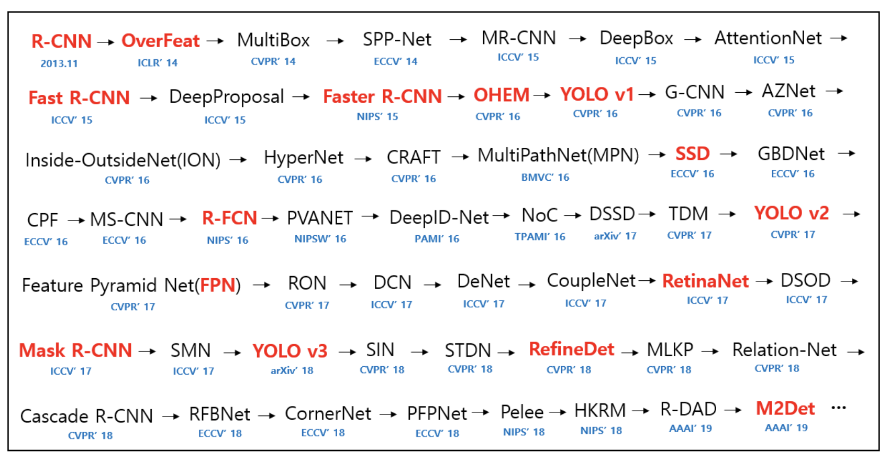

### 目标检测
-----

#### 重要算法模型

------

#### 必备模型

现在一个完整的目标检测网络主要由三部分构成：detector=backbone+neck+head

Detection Transformer

RetinaNet 

resent 
senet
frp，
rpn，
nms，
roi align ，
sppnet，
rcnn系列，
yolov系列，
ssd系列