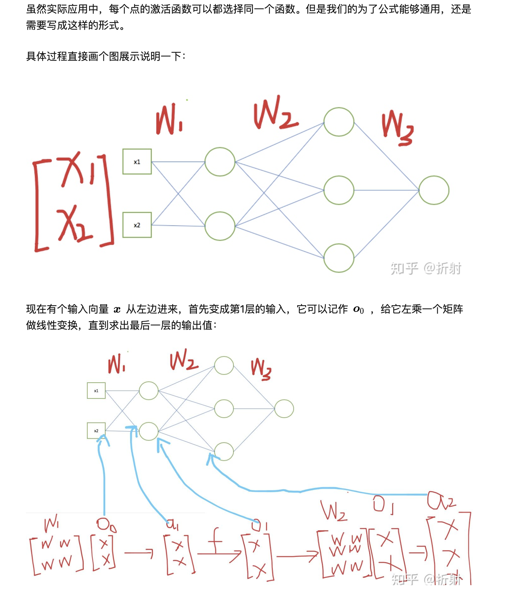
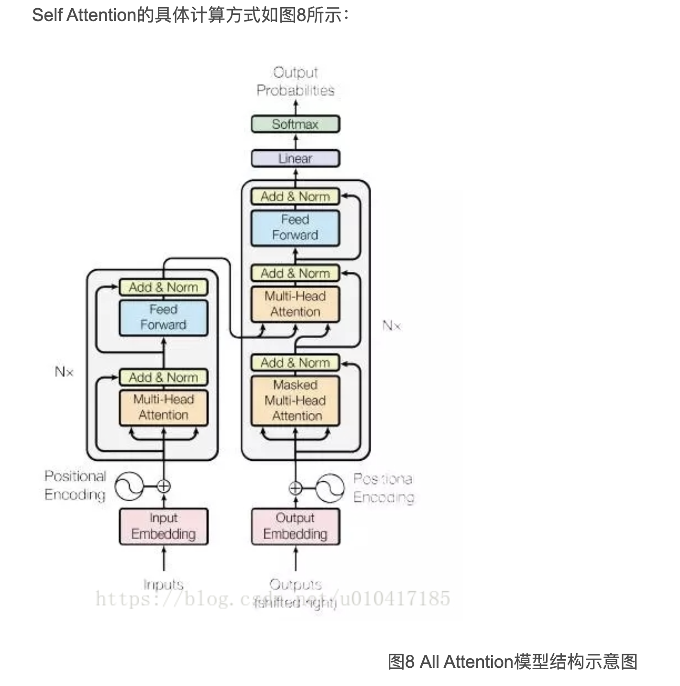
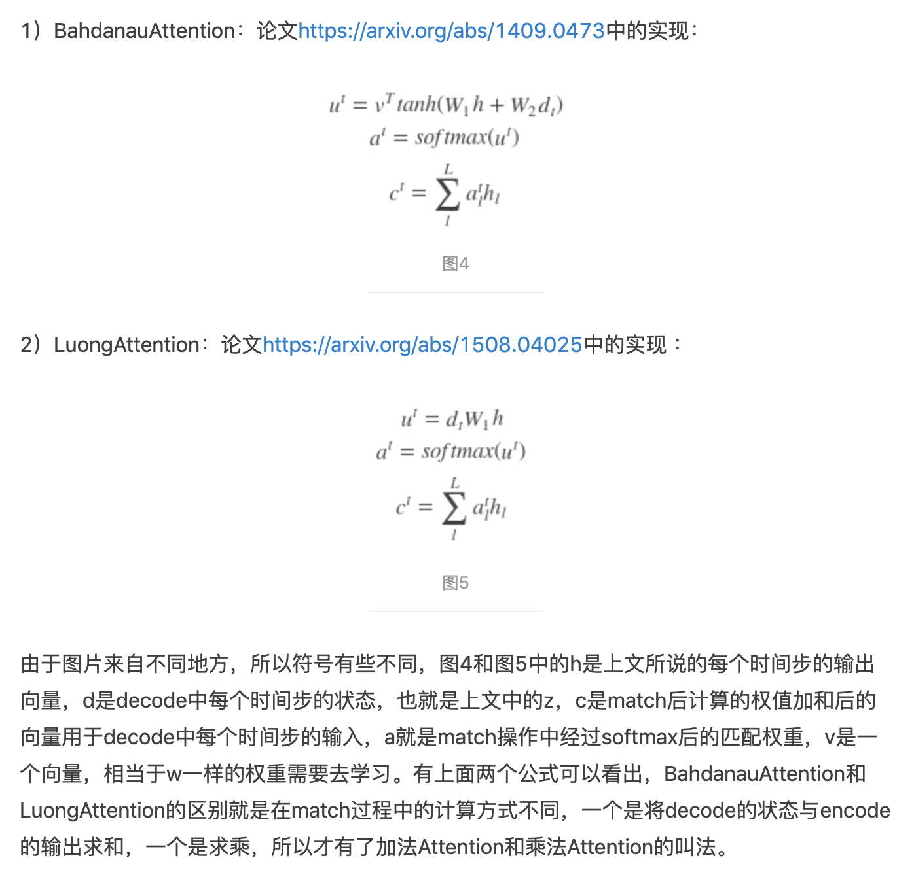
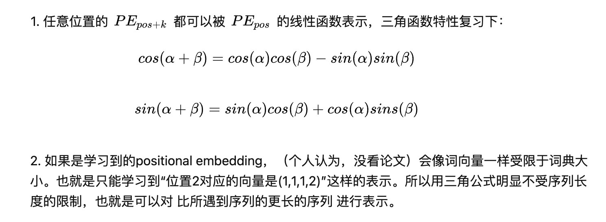
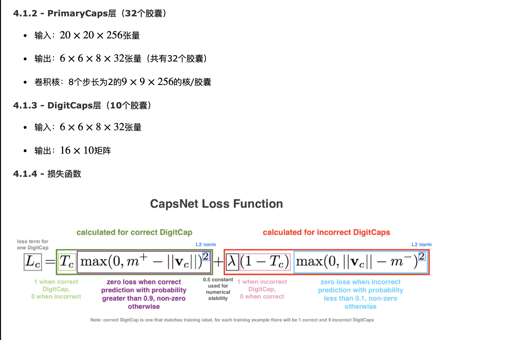
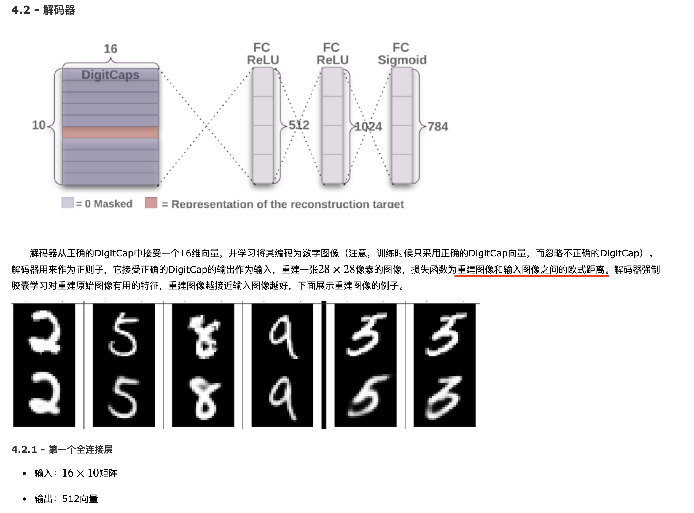
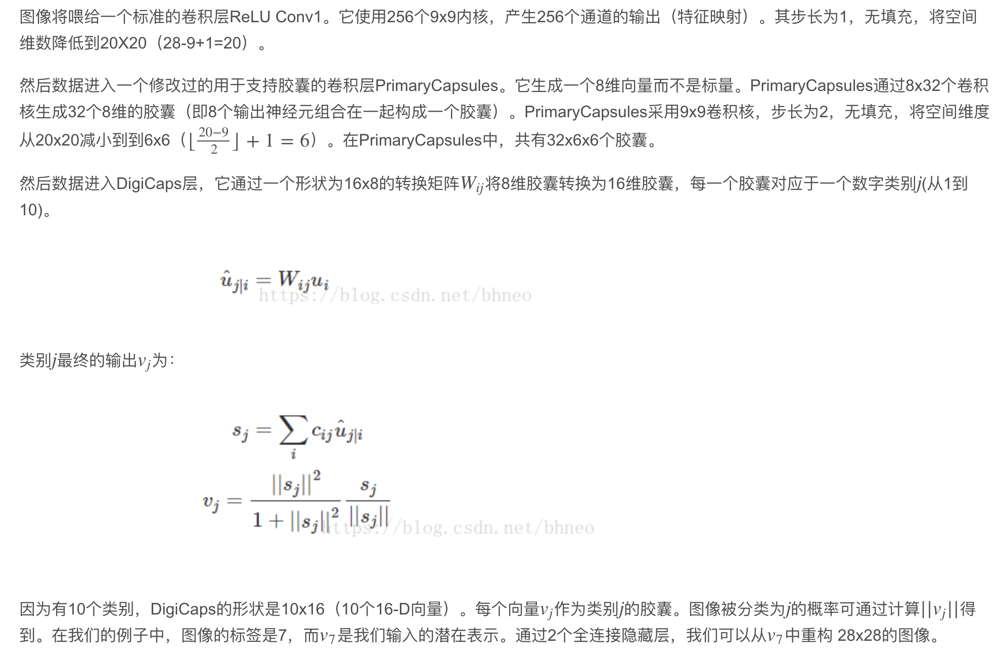

### Deep Learning
* [深度学习 - 神经网络](#)
    * [Basic knowledge](#Basic%20knowledge)
    * [Specific artificial neural networks](#Specific artificial neural networks)
        * [Linear Threshold Unit (or Perceptron) - 感知机 又称 基于LTN的人工神经元](#)
        * [Multilayer Perceptrons - 多层感知机](#Multilayer%20Perceptrons%20-%20多层感知机)
        * [Back Propagation Neural Network - 反向传播神经网络](#Back%20Propagation%20Neural%20Network%20-%20反向传播神经网络)
            * [激活函数](#激活函数)
            * [bp算法](#bp算法)
            * [反向传播神经网络计算过程](#反向传播神经网络计算过程)
            * [反向传播总结](#反向传播总结)
        * [Convolutional Neural Networks - 卷积神经网络](#Convolutional%20Neural%20Networks%20-%20卷积神经网络)
            * [基本结构](#基本结构)
            * [CNN训练方法](#CNN训练方法)
            * [CNN的卷积层](#CNN的卷积层)
            * [CNN的池化层 - 数据降维,避免过拟合](#CNN的池化层%20-%20数据降维,避免过拟合)
            * [CNN全连接网络](#CNN全连接网络)
            * [CNN 公式计算](#CNN%20公式计算)
            * [CNN 例子](#CNN%20例子)
            * [CNN 框架发展](#CNN%20框架发展)
        * [Batch Normalization](#Batch%20Normalization)
        * [AlexNet](#AlexNet)
        * [Restricted Boltzmann Machines - 受限玻尔兹曼机](#Restricted%20Boltzmann%20Machines%20-%20受限玻尔兹曼机)
            * [RBM 计算](#RBM%20计算)
            * [RBM 数学原理](#RBM%20数学原理)
            * [RBM 例子](#RBM%20例子)
        * [Deep Belief Network 深度置信网络](#Deep%20Belief%20Network%20深度置信网络)
        * [Autoencoder Networks - 自编码网络](#Autoencoder%20Networks%20-%20自编码网络)
            * [稀疏自编码器推导](#稀疏自编码器推导)
        * [generic artificial neural network - 遗传神经网络](#generic%20artificial%20neural%20network%20-%20遗传神经网络)
        * [Recurrent Neural Network 循环神经网络](#Recurrent%20Neural%20Network%20循环神经网络)
            * [循环神经网络推导求解](#循环神经网络推导求解)
            * [推导理解](#推导理解)
            * [基于时间的反向传播理解](#基于时间的反向传播理解)
            * [tanh梯度消失的问题](#tanh梯度消失的问题)
        * [Long short-term memory(LSTM) 长短时记忆网络](#)
            * [推导](#推导)
        * [Recursive Neural Network 递归神经网络](#Recursive%20Neural%20Network%20递归神经网络)
        * [Attention机制](#Attention机制)
            * [Attention Mechanism 原理](#)
            * [Attention Mechanism 模块图解](#)
            * [Attention 分类 ](#)
                * [Soft Attention 和 Hard Attention](#)
                * [Soft Attention 和 Hard Attention](#)
                * [Global Attention 和 Local Attention](#)
                * [Self Attention 及计算](#)
                * [Multi-Head Attention 及计算](#)
            * [Attention 的其他组合应用 ](#)
                * [Hierarchical Attention](#)
                * [Attention over Attention](#)
                * [Multi-step Attention](#)
                * [Multi-dimension Attention](#)
                * [Memory-based Attention](#)
            * [Attention 在图像领域的应用](#)
                * [学习权重分部](#) 
                    * [精细分类](#)
                    * [图像分类](#)
                    * [图像分割](#)
                    * [看图说话](#)
                * [任务聚焦/解耦](#)
                    * [图像分割](#)
                * [Attention 计算过程](#)
        * [Attention -> Transformer](#CAttention%20->%20Transformer)
        * [Capsule Networks - 胶囊网络](#Capsule%20Networks%20-%20胶囊网络)
        * [Competitive Learning Networks - 竞争学习神经网络](#Competitive%20Learning%20Networks%20-%20竞争学习神经网络)
        * [Graph Neural Networks(GNN) 图神经网络](#Graph%20Neural%20Networks(GNN)%20图神经网络)

        * [待补充](#)
            * [Inhibitory Feedback Networks - 抑制反馈网络](#Inhibitory%20Feedback%20Networks%20-%20抑制反馈网络)
            * [Radial Basis Function Networks - 径向基函数神经网络](#Radial%20Basis%20Function%20Networks%20-%20径向基函数神经网络)
            * [Hopfield Networks - 一种单层反馈神经网络](#Hopfield%20Networks%20-%20一种单层反馈神经网络)
            * [Kohonen Networks - 自组织特征映射 SOM(Self-organizing feature Map）](#)
            * [Capsule Networks - 胶囊网络](#Capsule%20Networks%20-%20胶囊网络)

-----

### Basic knowledge

##### ` Layers` can be:
* `visible` – receive inputs from, or send outputs to, the external environment
* `hidden` – only receive inputs and send output to other processing units
* `input layers`: receive signals from the environment – for classification, this is the feature vector which is to be classified
* `output layers`: which send signals to the environment  – for classification, this is the predicted class label associated with the feature vector

##### `Weights`   -    Connection weights can be defined by
* Setting weights explicitly using prior knowledge.
* Optimising connectivity to achieve some objective (e.g. using a genetic algorithm).
* Training the network by feeding it training data and allowing it to adapt the connection weights.
    * supervised    -   Delta Learning Rule
    * unsupervised  -   Hebbian learning rule

----

### Specific artificial neural networks
----
* #### Linear Threshold Unit (or Perceptron) - 感知机 又称 基于LTN的人工神经元
    * Each unit receives a vector of inputs, x (from other units or the external environment).
    * Each input is associated with a weight, w, which determines the strength of influence of each input.
    * Each w can be either +ve (excitatory) or -ve (inhibitory).
    * (restricted case, where weights and activations are binary, known as Threshold Logic Unit, or McCulloch-Pitts neuron)
    

    * This `response function` often split into two component parts:
        * A `transfer function` that determines how the inputs are integrated.
        * An `activation function` that determines the output the neuron produces.
    
    * `w` and `θ` definea hyperplane that divides the input space into two parts
    * This `hyperplane` is called the “`decision boundary`.”

    

----

* #### Multilayer Perceptrons - 多层感知机

----
* #### Back Propagation Neural Network - 反向传播神经网络
    * ##### 激活函数
    
    * ##### bp算法
     
     
     

    * ##### 反向传播神经网络计算过程
    
    
    
    
    
    
    
    
    
    
    
    
    
    
    
    
    
    
    
    
    
    
    
    * ##### 反向传播总结
    
    
    
    
    
    
    

----

* #### Convolutional Neural Networks - 卷积神经网络
https://cs231n.github.io/convolutional-networks/
* 基本结构

* CNN训练方法

    

* CNN的卷积层

* CNN的池化层 - 数据降维,避免过拟合
池化层相比卷积层可以更有效的降低数据维度，这么做不但可以大大减少运算量，还可以有效的避免过拟合。

* CNN全连接网络

* CNN 公式计算
训练方式为反向传播

* CNN 例子

* CNN 框架发展

----

* #### Batch Normalization

----

* #### AlexNet

----

* #### Restricted Boltzmann Machines - 受限玻尔兹曼机
https://www.cs.toronto.edu/~rsalakhu/papers/rbmcf.pdf
https://www.cs.toronto.edu/~hinton/absps/guideTR.pdf

* RBM 计算

* RBM 数学原理

* RBM 例子

-----
* #### Deep Belief Network 深度置信网络
https://s-top.github.io/blog/2018-01-19-dbn

-----

* #### Autoencoder Networks - 自编码网络
https://zhuanlan.zhihu.com/p/54032437

* 稀疏自编码器推导

-----

* #### generic artificial neural network - 遗传神经网络

* An `environment` in which the system operates (inputs to the network, outputs from the network).
* A set of `processing units` (‘neurons’, ‘cells’, ‘nodes’).
* A set of `weighted connections` between units, wji, which determines the influence of unit i on unit j.
* A `transfer function` that determines how the inputs to a unit are integrated.
* An `activation function` that determines the output the neuron produces.
* An `activation state`, yj, for every unit (‘response’, ‘output’).
* A `method` for setting/changing the connection weights.
------

* #### Recurrent Neural Network 循环神经网络
https://zhuanlan.zhihu.com/p/32755043

* 循环神经网络推导求解
https://www.cnblogs.com/YiXiaoZhou/p/6058890.html

* 推导理解

* 基于时间的反向传播理解

* tanh梯度消失的问题

----

* #### Long short-term memory(LSTM) 长短时记忆网络
循环神经网络(RNN) 的优化算法

* 推导

------

* #### Recursive Neural Network 递归神经网络

----------

* #### Attention机制

-----

* #### Attention -> Transformer
CV - DETR (https://github.com/facebookresearch/detr)
CV - SCA-CNN
目标检测：ResNeSt - Split-Attention Networks (https://github.com/zhanghang1989/ResNeSt)(https://hangzhang.org/files/resnest.pdf)
[重要参考](http://jalammar.github.io/illustrated-transformer/)

[方法2参考文献](https://arxiv.org/abs/1705.03122)

-----

* #### Capsule Networks - 胶囊网络

https://jhui.github.io/2017/11/03/Dynamic-Routing-Between-Capsules/

* 各层参数计算

* 胶囊网络-动态路由算法

矩阵胶囊： https://jhui.github.io/2017/11/14/Matrix-Capsules-with-EM-routing-Capsule-Network/

* 胶囊网络实现

    https://blog.csdn.net/bhneo/article/details/79391469

--------

* #### Competitive Learning Networks - 竞争学习神经网络

所谓竞争学习神经网络，是在输出层对多个节点返回的数据做选择。选择方法可以是投票可以是算平均值等。

-----

* #### Graph Neural Networks(GNN) 图神经网络

清华大学GNN paper list: https://github.com/thunlp/GNNPapers/blob/master/README.md#survey-papers

----

--------

* #### Inhibitory Feedback Networks - 抑制反馈网络

* #### Radial Basis Function Networks - 径向基函数神经网络

* #### Hopfield Networks - 一种单层反馈神经网络

* #### Kohonen Networks - 自组织特征映射 SOM(Self-organizing feature Map）

* #### Capsule Networks - 胶囊网络

-----

