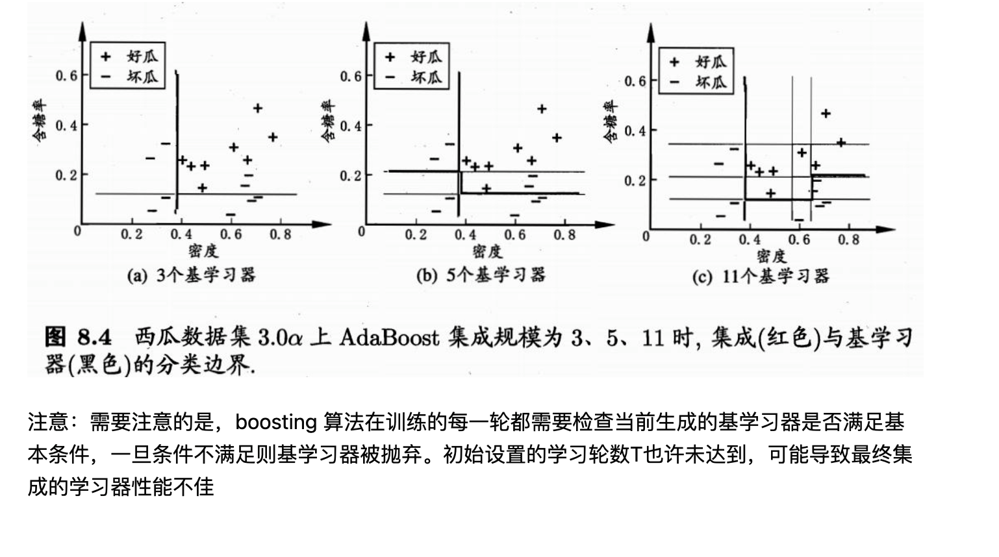

----
## 集成学习

* 集成学习会挑选一些简单的基础模型进行组装，组装这些基础模型的思路主要有 2 种方法：
    1. bagging（bootstrap aggregating的缩写，也称作“套袋法”）
        * 并行式集成学习方法最著名的代表
        * Bagging 的思路是所有基础模型都一致对待，每个基础模型手里都只有一票。然后使用民主投票的方式得到最终的结果。
        * 大部分情况下，经过 bagging 得到的结果方差（variance）更小。
        * 在 bagging 的方法中，最广为熟知的就是随机森林了：bagging + 决策树 = 随机森林
        * 具体过程
            1. 从原始样本集中抽取训练集。每轮从原始样本集中使用Bootstraping的方法抽取n个训练样本（在训练集中，有些样本可能被多次抽取到，而有些样本可能一次都没有被抽中）。共进行k轮抽取，得到k个训练集。（k个训练集之间是相互独立的）
            2. 每次使用一个训练集得到一个模型，k个训练集共得到k个模型。（注：这里并没有具体的分类算法或回归方法，我们可以根据具体问题采用不同的分类或回归方法，如决策树、感知器等）
            3. 对分类问题：将上步得到的k个模型采用投票的方式得到分类结果；对回归问题，计算上述模型的均值作为最后的结果。（所有模型的重要性相同）
                
        
    2. boosting
        * Boosting 和 bagging 最本质的差别在于他对基础模型不是一致对待的，而是经过不停的考验和筛选来挑选出「精英」，然后给精英更多的投票权，表现不好的基础模型则给较少的投票权，然后综合所有人的投票得到最终结果。
        * 大部分情况下，经过 boosting 得到的结果偏差（bias）更小
        * 在 boosting 的方法中，比较主流的有 Adaboost 和 Gradient boosting 。
        * 具体过程
            1. 通过加法模型将基础模型进行线性的组合。
            2. 每一轮训练都提升那些错误率小的基础模型权重，同时减小错误率高的模型权重。
            3. 在每一轮改变训练数据的权值或概率分布，通过提高那些在前一轮被弱分类器分错样例的权值，减小前一轮分对样例的权值，来使得分类器对误分的数据有较好的效果。
                

* Boosting 和 bagging 的异同
* 样本选择上：
    * Bagging：训练集是在原始集中有放回选取的，从原始集中选出的各轮训练集之间是独立的。
    * Boosting：每一轮的训练集不变，只是训练集中每个样例在分类器中的权重发生变化。而权值是根据上一轮的分类结果进行调整。
* 样例权重：
    * Bagging：使用均匀取样，每个样例的权重相等
    * Boosting：根据错误率不断调整样例的权值，错误率越大则权重越大。
* 预测函数：
    * Bagging：所有预测函数的权重相等。
    * Boosting：每个弱分类器都有相应的权重，对于分类误差小的分类器会有更大的权重。
* 并行计算：
    * Bagging：各个预测函数可以并行生成
    * Boosting：各个预测函数只能顺序生成，因为后一个模型参数需要前一轮模型的结果。

---
## Boosting 方法 - 模型融合

### Boosting 简介
* 对于一个复杂任务来说，将多个专家的判断进行`适当（按照一定权重）`的`综合（例如线性组合加法模型）`所得出的判断，要比其中任何一个专家单独的判断好

* 在`概率近似正确（probably approximately correct，PAC）`学习框架中：
    * 一个概念（一个类，label），如果存在一个多项式的学习算法能够学习它，并且`正确率很高`，那么就称这个概念是`强可学习的`；
    * 一个概念（一个类，label），如果存在一个多项式的学习算法能够学习它，学习的`正确率仅比随机猜测略好`，那么就称这个概念是`弱可学习的`。
    * `强可学习和弱可学习是等价的`。 也就是说，在PAC学习的框架下，一个概念是强可学习的 充分必要条件 是这个概念是弱可学习的。
    * 这样一来，问题就转化为了，在算法训练建模中，如果已经发现了“弱可学习算法”（即当前分类效果并不优秀，甚至仅仅比随机预测效果要好），就有可能将其boosting（提升）为强可学习算法，这其中最具代表性的方法就是AdaBoosting（AdaBoosting algorithm）

* Boosting 要做的事情就是把弱可学习方法变成强可学习方法，提升方法就是从弱学习算法出发，反复学习，得到一系列弱分类器（基本分类器），然后组合这些弱分类器，构成一个强分类器。大多数的提升方法都是改变训练数据的概率分布（训练数据的权重分布）

* Boosting 思路：
    对于一个学习问题来说（以分类问题为例），给定训练数据集，求一个弱学习算法要比求一个强学习算法要容易的多。Boosting方法就是从弱学习算法出发，反复学习，得到一系列弱分类器，然后组合弱分类器，得到一个强分类器。Boosting方法在学习过程中通过改变训练数据的权值分布，针对不同的数据分布调用弱学习算法得到一系列弱分类器。

* 常见的模型组合方法有：
    * 简单平均（Averaging）
    * 投票（voting）
    * Bagging（randomforest）
    * boosting（GBDT）
    * stacking
    * blending
    * 等

* Boosting设计的问题：
    1. 在每一轮学习之前，如何改变训练数据的权值分布？
        (Adaboost算法的做法是：提高那些被前一轮弱分类器错误分类样本的权值，而降低那些被正确分类样本的权值。)
    2. 如何将一组弱分类器组合成一个强分类器？
        (AdaBoost采取加权多数表决的方法。具体地：`加大分类误差率小` 的弱分类器的权值，使其在表决中起较大的作用；`减小分类误差率大`的弱分类器的权值，使其在表决中起较小的作用。)

### Forward Stagewise Additive Modeling - 前向分步加法模型

### 四大 Boosting 算法

L2Boosting全称：Least Squares Boosting；该算法由Buhlmann和Yu在2003年提出。

----

## Adaboost (Adaptive Boosting) 算法

* 由Yoav Freund和Robert Schapire在1995年提出
* 它的自适应在于：
    前一个基本分类器分错的样本会得到加强，加权后的全体样本再次被用来训练下一个基本分类器。同时，在每一轮中加入一个新的弱分类器，直到达到某个预定的足够小的错误率或达到预先指定的最大迭代次数。

* 算法步骤
    1. 初始化训练数据的权值分布。如果有N个样本，则每一个训练样本最开始时都被赋予相同的权值：1/N。
    2. 训练弱分类器。具体训练过程中，如果某个样本点已经被准确地分类，那么在构造下一个训练集中，它的权值就被降低；相反，如果某个样本点没有被准确地分类，那么它的权值就得到提高。然后，权值更新过的样本集被用于训练下一个分类器，整个训练过程如此迭代地进行下去。
    3. 将各个训练得到的弱分类器组合成强分类器。各个弱分类器的训练过程结束后，加大分类误差率小的弱分类器的权重，使其在最终的分类函数中起着较大的决定作用，而降低分类误差率大的弱分类器的权重，使其在最终的分类函数中起着较小的决定作用。换言之，误差率低的弱分类器在最终分类器中占的权重较大，否则较小。

### adaboost 算法流程

### adaboost 误差界分析

### adaboost 案例分析

------

### GBDT(Gradient Boosting Decision Tree) 梯度提升树

* GBDT主要由三个概念组成：
    * Regression Decistion Tree（即DT)，
    * Gradient Boosting（即GB)，
    * Shrinkage (算法的一个重要演进分枝，目前大部分源码都按该版本实现）
    * 理解它如何用于搜索排序则需要额外理解RankNet概念，之后便功德圆满。

#### Regression Decision Tree(DT) 回归树

