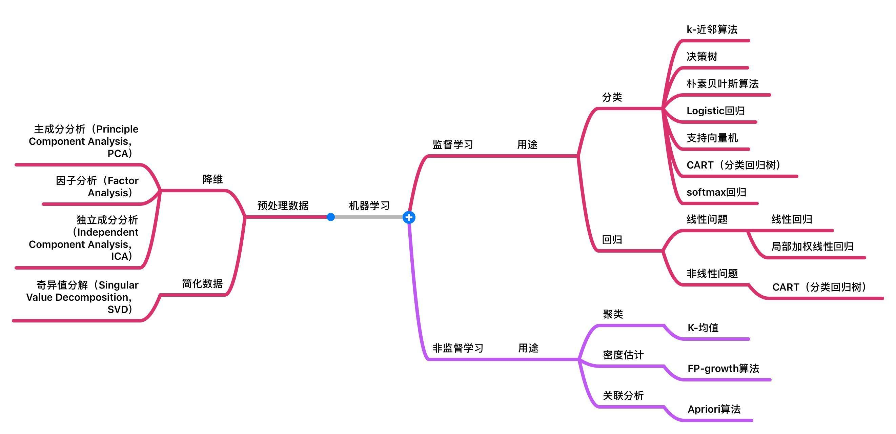
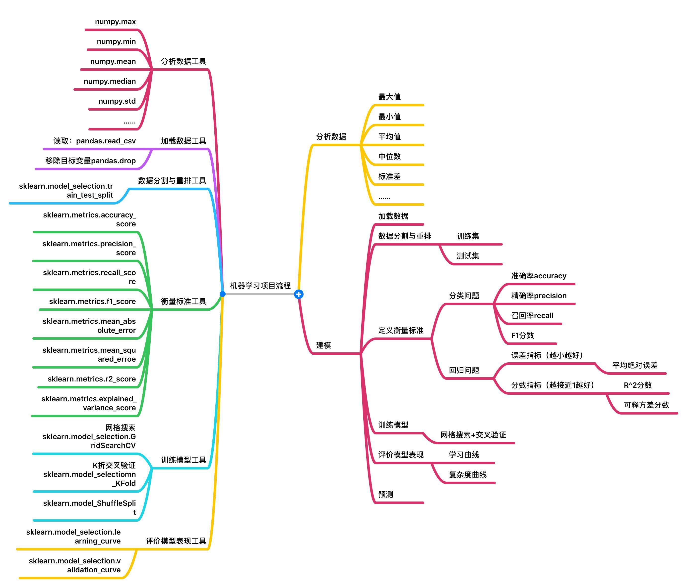

---

### Machine learning method

* Supervised machine learning algorithms： 用于有标签的，已分类的数据。用已知的知识去预测分类新的知识。

* unsupervised machine learning algorithms ： 用于训练的数据既没有分类也没有标记。无监督学习研究如何从未标记的数据中推断出隐藏结构。无监督学习无法找出正确的输出，但可以浏览数据并得到推论，以描述未标记数据中的结构。

* Semi-supervised machine learning algorithms ：半监督学习算法。介于有监督和无监督学习之间，同时使用标记和未标记数据进行训练。通常使用少量有标签数据和大量无标签数据进行训练，这种方法可以大大提高准确性。通常，当需要标记的数据需要相关和熟练的资源以供其训练时，选择半监督学习。半监督学习方法的性能依赖于所用的半监督假设。

* Reinforcement machine learning algorithms： 强化机器学习。 通过产生动作并发现错误或奖励来与环境互动。反复试验和延迟奖励是强化学习的特征。强化学习允许机器和软件代理自动确定特定上下文的理想行为，以使其性能最大化。代理需要反馈，以了解那种行动最好，这就是增强信号。

### Machine learning method

* Supervised machine learning algorithms： 用于有标签的，已分类的数据。用已知的知识去预测分类新的知识。
* unsupervised machine learning algorithms ： 用于训练的数据既没有分类也没有标记。无监督学习研究如何从未标记的数据中推断出隐藏结构。无监督学习无法找出正确的输出，但可以浏览数据并得到推论，以描述未标记数据中的结构。

* Semi-supervised machine learning algorithms ：半监督学习算法。介于有监督和无监督学习之间，同时使用标记和未标记数据进行训练。通常使用少量有标签数据和大量无标签数据进行训练，这种方法可以大大提高准确性。通常，当需要标记的数据需要相关和熟练的资源以供其训练时，选择半监督学习。半监督学习方法的性能依赖于所用的半监督假设。

* Reinforcement machine learning algorithms： 强化机器学习。 通过产生动作并发现错误或奖励来与环境互动。反复试验和延迟奖励是强化学习的特征。强化学习允许机器和软件代理自动确定特定上下文的理想行为，以使其性能最大化。代理需要反馈，以了解那种行动最好，这就是增强信号。

---

### Supervised machine learning algorithms:

* Analytical learning  - 分析学习
* Artificial neural network - 人工神经网络
* Backpropagation   -  反向传播
* Boosting (meta-algorithm) - 元算法
* Bayesian statistics -   贝叶斯统计
* Case-based reasoning  -   基于案例的推理
* Decision tree learning    -   决策树学习
* Inductive logic programming   -   归纳逻辑编程
* Gaussian process regression   -   高斯过程回归
* Genetic Programming   -   遗传算法
* Group method of data handling -  数据处理的分组方法
* Kernel estimators - 核估计器
* Learning Automata -   学习自动状态机
* Learning Classifier Systems   -   学习分类器系统
* Minimum message length (decision trees, decision graphs, etc.)    -   最小消息长度（决策树，决策图）
* Multilinear subspace learning -   多线性子空间学习
* Naive Bayes classifier    -   朴素贝叶斯分类
* Maximum entropy classifier    -   最大熵分类器
* Conditional random field  -   随机条件场
* Nearest Neighbor Algorithm    -   最大临近算法
* Probably approximately correct learning (PAC) learning    -   大概近似学习（PCA）
* Ripple down rules, a knowledge acquisition methodology    -   波动降低规则，一种知识获取方法
* Symbolic machine learning algorithms  -   符号机器学习算法
* Subsymbolic machine learning algorithms   -   亚符号机器学习算法
* Support vector machines   -   支持向量机
* Minimum Complexity Machines (MCM) -   最低复杂度机器
* Random Forests    -   随机森林
* Ensembles of Classifiers  -   分类器集合
* Ordinal classification    -   顺序分类
* Data Pre-processing   -   数据预处理
* Handling imbalanced datasets  -   处理不平衡的数据集
* Statistical relational learning   -   统计关系学习
* Proaftn, a multicriteria classification algorithm     -   Proaftn 多准则分类算法

---

### Machine learning method

* Supervised machine learning algorithms： 用于有标签的，已分类的数据。用已知的知识去预测分类新的知识。

* unsupervised machine learning algorithms ： 用于训练的数据既没有分类也没有标记。无监督学习研究如何从未标记的数据中推断出隐藏结构。无监督学习无法找出正确的输出，但可以浏览数据并得到推论，以描述未标记数据中的结构。

* Semi-supervised machine learning algorithms ：半监督学习算法。介于有监督和无监督学习之间，同时使用标记和未标记数据进行训练。通常使用少量有标签数据和大量无标签数据进行训练，这种方法可以大大提高准确性。通常，当需要标记的数据需要相关和熟练的资源以供其训练时，选择半监督学习。半监督学习方法的性能依赖于所用的半监督假设。

* Reinforcement machine learning algorithms： 强化机器学习。 通过产生动作并发现错误或奖励来与环境互动。反复试验和延迟奖励是强化学习的特征。强化学习允许机器和软件代理自动确定特定上下文的理想行为，以使其性能最大化。代理需要反馈，以了解那种行动最好，这就是增强信号。

---
### Supervised machine learning algorithms:

* Analytical learning  - 分析学习
* Artificial neural network - 人工神经网络
* Backpropagation   -  反向传播
* Boosting (meta-algorithm) - 元算法
* Bayesian statistics -   贝叶斯统计
* Case-based reasoning  -   基于案例的推理
* Decision tree learning    -   决策树学习
* Inductive logic programming   -   归纳逻辑编程
* Gaussian process regression   -   高斯过程回归
* Genetic Programming   -   遗传算法
* Group method of data handling -  数据处理的分组方法
* Kernel estimators - 核估计器
* Learning Automata -   学习自动状态机
* Learning Classifier Systems   -   学习分类器系统
* Minimum message length (decision trees, decision graphs, etc.)    -   最小消息长度（决策树，决策图）
* Multilinear subspace learning -   多线性子空间学习
* Naive Bayes classifier    -   朴素贝叶斯分类
* Maximum entropy classifier    -   最大熵分类器
* Conditional random field  -   随机条件场
* Nearest Neighbor Algorithm    -   最大临近算法
* Probably approximately correct learning (PAC) learning    -   大概近似学习（PCA）
* Ripple down rules, a knowledge acquisition methodology    -   波动降低规则，一种知识获取方法
* Symbolic machine learning algorithms  -   符号机器学习算法
* Subsymbolic machine learning algorithms   -   亚符号机器学习算法
* Support vector machines   -   支持向量机
* Minimum Complexity Machines (MCM) -   最低复杂度机器
* Random Forests    -   随机森林
* Ensembles of Classifiers  -   分类器集合
* Ordinal classification    -   顺序分类
* Data Pre-processing   -   数据预处理
* Handling imbalanced datasets  -   处理不平衡的数据集
* Statistical relational learning   -   统计关系学习
* Proaftn, a multicriteria classification algorithm     -   Proaftn 多准则分类算法

---

### Unsupervised learning
Unspervised learning is a type of machine learning that looks for previously undetected patterns in a data set with no pre-existing labels and with a minimum of human supervision. In contrast to supervised learning that usually makes use of human-labeled data, unsupervised learning, also known as self-organization allows for modeling of probability densities over inputs.

* 无监督学习是在没有打标的数据中寻找没有检测到的模式。无监督学习允许对输入进行概率密度建模。
* 无监督学习中两种主要的方式是 主成分分析（PCA） 和  聚类分析。 被称为无监督学习策略的唯一要求是通过最大化某些目标函数或最小化某些损失函数来学习一个捕获原始空间特征的新特征空间。因此，生成协方差矩阵并不是学习的非监督方法，而是采用协方差矩阵的特征向量，因为特征分解线性代数运算能最大程度地提高方差。同样，进行数据集的对数变换也不是无监督学习，而是将输入数据通过多个S形函数传递，同时最小化生成的数据与结果数据之间的距离函数，这被称为自动编码器。
* 
---

### Unspevised leaning algorithms:
Some of the most common algorithms used in unsupervised learning include: 
* Clustering    -   聚类
* Anomaly detection -   异常检测 
* Neural Networks   -   神经网络
* Approaches for learning latent variable models.   -   学习潜在变量的模型方法 

#### Each approach uses several methods as follows:
##### Clustering:
* hierarchical clustering   -   分级聚类
* k-means   
* mixture models    -   混合模型
* DBSCAN    -   基于密度的带噪声应用程序空间聚类
* OPTICS algorithm  -   OPTICS算法

##### Anomaly detection
* Local Outlier Factor  -   局部离群因子
* Isolation Forest  -   隔离森林

##### Neural Networks  
* Autoencoders  -   自动编码器
* Deep Belief Nets  -   深信网
* Hebbian Learning  -   赫布理论
* Generative adversarial networks   -   生成对抗网络
* Self-organizing map   -   自组织映射
* ANN——人工神经网络
* CNN——卷积神经网络
* RNN——循环神经网络
    * Long Short-Term Memory -  LSTM 时间递归神经网络

##### Approaches for learning latent variable models such as
* Expectation–maximization algorithm (EM)   -   期望最大化算法
* Method of moments -   矩量法
* Blind signal separation techniques    -   盲信号分离
    * Principal component analysis  -   PCA主成分分析
    * Independent component analysis    -   独立成分分析
    * Non-negative matrix factorization     -   非负矩阵分解
    * Singular value decomposition      -   奇异值分解

---

