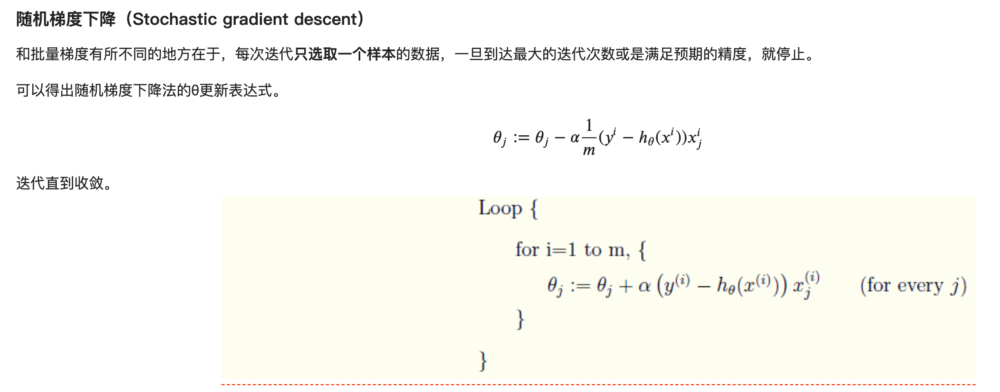
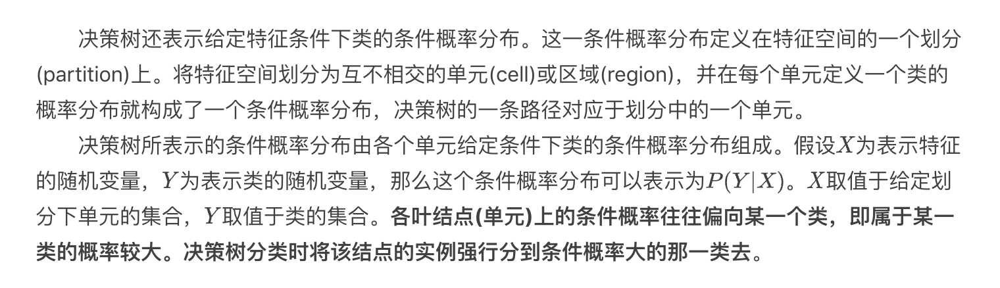

#### 本页目录

* [有监督学习](#有监督学习)
    * [线性回归和逻辑回归比较](#线性回归和逻辑回归比较)
    * [回归算法]()
        * [Linear regression - 线性回归 ](#Linear%20regression%20-%20线性回归)
            * [线性回归参数求解方法一：解析法 ](#解析法)
            * [线性回归参数求解方法二：梯度下降 ](#梯度下降)
    * [分类算法 - 预测的变量是离散的]()
        * [Logistic regression - 逻辑回归 ](#Logistic%20regression%20-%20逻辑回归)
            * [逻辑回归 - 简介](#简介)
            * [逻辑回归的 cost function](#逻辑回归的%20cost%20function)
            * [线性回归参数求解方法二：梯度下降 ](#梯度下降)
            * [逻辑回归参数求解 （最小化 cost function, 或 最大化 极大似然函数)](#逻辑回归参数求解%20（最小化%20cost%20function,%20或%20最大化%20极大似然函数）)
                * [方法一：梯度下降](#方法一：梯度下降)
                    * [梯度下井推导过程](#梯度下井推导过程)
                    * [梯度下降的可行性 解释](#梯度下降的可行性%20解释)
                * [方法二：牛顿法](#方法二：牛顿法)
                    * [牛顿法推导](#牛顿法推导)
                * [求解正则化](#求解正则化)
                    * [L1正则化](#L1正则化)
                    * [L2正则化](#L1正则化)
                * [并行化 求解 梯度下降或牛顿法](#并行化求解梯度下降或牛顿法)
                    * [计算步骤](#计算步骤)
        * [Softmax regression （SMR） - 可用于多分类](#Logistic%20regression%20-%20逻辑回归)
            * [SMR 一般步骤](#一般步骤)
            * [Softmax定义](#Softmax定义)
            * [Softmax模型定义](#Softmax模型定义)
            * [Softmax cost function - 定义为 交叉熵](#Softmax%20cost%20function%20-%20定义为%20交叉熵)
            * [Softmax Regression 多分类例子](#Softmax%20Regression%20多分类例子)
            * [Softmax Regression 与 logistic regression 的联系](#Softmax%20Regression%20与%20logistic%20regression%20的联系)
            * [Softmax Regression 过拟合问题 - 处理方法为减少特征数量或正则化](#Softmax%20Regression%20过拟合问题%20-%20处理方法为%20`减少特征数量`%20或%20`正则化`)
        * [朴素贝叶斯](#朴素贝叶斯分类)
            * [朴素贝叶斯算法过程](#朴素贝叶斯算法过程)
            * [朴素贝叶斯详解](#朴素贝叶斯详解)
            * [朴素贝叶斯例子](#朴素贝叶斯例子)
            * [朴素贝叶斯优缺点](#朴素贝叶斯优缺点)
    * [回归分类都可以的算法]()
        * [决策树](#决策树)
            * [决策树关键问题](#决策树关键问题)
            * [决策树学习](#决策树学习)
            * [决策树与概率分布](#决策树与概率分布)
            * [决策树的构造算法](#决策树的构造算法)
            * [决策树的特征选择方法](#决策树的特征选择方法)
            * [ID3 算法](#ID%203算法)
                * [ID3 算法的不足](#ID3%20算法的不足)
            * [C4.5 算法](#C4.5%20算法)
                * [C4.5 算法改进](#C4.5%20算法改进)
                * [C4.5 算法的不足](#C4.5%20算法的不足)
            * [CART树](#CART树)
                * [CART 分类树树 特征选择方法](#CART%20分类树树%20特征选择方法)
                * [CART分类树对于连续特征和离散特征的处理](#CART分类树对于连续特征和离散特征的处理)
                * [CART分类树算法](#CART分类树算法)
                * [CART回归树算法](#CART回归树算法)
                * [CART树算法的剪枝](#CART树算法的剪枝)
                * [CART回归树算法](#CART回归树算法)
                * [CART中 类别不平衡 问题](#CART中%20类别不平衡%20问题)
                * [CART树缺点](#CART树缺点)
            * [多变量决策树-斜决策树(OC1算法)](#多变量决策树_斜决策树(OC1算法))
            * [决策树总结](#决策树总结)
            * [决策树例子](#决策树例子)
        * [SVM](#SVM详解)
            * [SVM 例子(KCL-course work)](#SVM详解)   
            * [SVM详解](#SVM详解)
        * [k-Nearest Neighbors (KNN)](#KNN算法解析)
            * [KNN算法解析](#KNN算法解析)
            * [KNN算法实现](#KNN算法实现)
            * [KNN算法拓展](#KNN算法拓展)
            * [KNN算法优缺点](#KNN算法优缺点)

----

## 有监督学习
* 回归算法 - 预测的变量是连续的
    * linear regression - 线性回归

* 分类算法 - 预测的变量是离散的
    * logistic regression - 逻辑回归 - （统计方法）
    * Softmax regression - 可用于多分类
    * Decision Tree -  决策树
    * SVM - 支持向量 - （几何方法）

### 线性回归和逻辑回归比较

* 线性回归只能用于回归问题，逻辑回归虽然名字叫回归，但是更多用于分类问题
* 线性回归要求因变量是`连续性数值变量`，而逻辑回归要求因变量是`离散的变量`
* 线性回归要求自变量和因变量呈线性关系，而逻辑回归不要求自变量和因变量呈线性关系
* 线性回归可以直观的表达`自变量和因变量之间的关系`，逻辑回归则无法表达变量之间的关系

### Linear regression - 线性回归 

* 给定数据集D={(x1, y1), (x2, y2), ...}，我们试图从此数据集中学习得到一个线性模型，这个模型尽可能准确地反应x(i)和y(i)的对应关系。这里的线性模型，就是属性(x)的线性组合的函数，可表示为：

* 通俗的理解：x(i)就是一个个属性（例如西瓜书中的色泽，根蒂；Andrew ng示例中的房屋面积，卧室数量等），theta(或者w/b)，就是对应属性的参数（或者权重），我们根据已有数据集来求得属性的参数（相当于求得函数的参数），然后根据模型来对于新的输入或者旧的输入来进行预测（或者评估）。

* 从下图来直观理解一下线性回归优化的目标——图中线段距离（平方）的平均值，也就是最小化到分割面的距离和。

* 也就是说我们尽量使得f(xi)接近于yi，那么问题来了，我们如何衡量二者的差别？常用的方法是均方误差，也就是（均方误差的几何意义就是欧氏距离）最小二乘法。最小二乘法即为线性回归的损失函数 （loss function）。

* 这里，将上式中的 b 也向量化，吸纳到 w 中。

* 此时，线性回归的目标就是求得

* 这里，argmin是指求得最小值时的w,b的取值

* 这里可以采用两种方式完成求解，当维度不高时可以采用解析法。当处理高纬度数据时可以使用梯度下降求解。
    * #### 解析法
    
        * E是关于 (w,b)的凸函数，只有一个最小值。此时，所求即为E为最小是的 (w,b) 取值。
            
        * 对于凸函数E关于w,b导数都为零时，就得到了最优解。
        * 若是一维数据，可分别对w,b求导，令等式为0，即可计算。
        * 若是多维数据，则使用矩阵。
        * 此时，解析解为：
            
    
    

* 以下是多元线性回归 最小二乘法 推导过程
    

    * #### 梯度下降
        * 由上一步，根据最小二乘法得到 cost function (损失函数)，这里使用梯度下降方法求解损失函数最小值时的参数值。（最优化问题）
        * 梯度下降有不同的方法，分别为
            * batch gradient descent - 批梯度下降: 权重的更新通过计算全部训练集的数据
            * Stochastic Gradient Descent, （SGD） - 随机梯度下降: 当数据量特别大时，`在计算最快下降方向时，随机选择一个数据进行计算，而不是扫描所有的训练数据`，这样就`加快了迭代速度`。 随机梯度下降并不是沿着 cost function 下降最快的方向进行，是以震荡的方式趋向极小点。
            *  批量梯度下降
                
                
            * 随机梯度下降
                
    
     
     
        

### Logistic regression - 逻辑回归

* Logistic 回归的本质是：假设数据服从这个分布，然后使用极大似然估计做参数的估计。
* 逻辑回归的思路是，先拟合决策边界(不局限于线性，还可以是多项式)，再建立这个边界与分类的概率联系，从而得到了二分类情况下的概率

* 它输出一个 0 到 1 之间的离散二值结果。简单来说，它的结果不是 1 就是 0。
* Logistic 回归通过使用其固有的 logistic 函数估计概率，来衡量因变量（我们想要预测的标签）与一个或多个自变量（特征）之间的关系。

* 逻辑回归`优点`
    * 直接对分类的概率建模，无需实现假设数据分布，从而避免了假设分布不准确带来的问题；
    * 不仅可预测出类别，还能得到该预测的概率，这对一些利用概率辅助决策的任务很有用；
    * 对数几率函数是任意阶可导的凸函数，有许多数值优化算法都可以求出最优解。
    * 实现简单，广泛的应用于工业问题上；
    * 分类时计算量非常小，速度很快，存储资源低；
    * 便利的观测样本概率分数；
    * 对逻辑回归而言，多重共线性并不是问题，它可以结合L2正则化来解决该问题；
    * 计算代价不高，易于理解和实现；

* `缺点`
    * 当特征空间很大时，逻辑回归的性能不是很好；
    * 容易`欠拟合`，一般准确度不太高
    * 不能很好地处理大量多类特征或变量；
    * 只能处理两分类问题（在此基础上衍生出来的softmax可以用于多分类），且`必须线性可分`；
    * 对于非线性特征，需要进行转换；

* #### 简介

#### 逻辑回归的 cost function

#### 逻辑回归参数求解 （最小化 cost function, 或 最大化 极大似然函数）

* ##### 方法一：梯度下降

    * 
    
    * ###### 梯度下井推导过程
    
    
    
    
    * ###### 梯度下降的可行性 解释
    

* ##### 方法二：牛顿法

    

    * ###### 牛顿法推导

    

#### 求解正则化

* 正则化是一个通用的算法和思想，所以会产生过拟合现象的算法都可以使用正则化来避免过拟合。

* ##### L1正则化
    
    
    
    * 拉普拉斯分布

    

* ##### L2正则化

    

    * 正态分布
    
    

#### 并行化求解梯度下降或牛顿法

* 逻辑回归的并行化最主要的就是对目标函数梯度计算的并行化。

* 并行 LR 实际上就是在求解损失函数最优解的过程中，针对寻找损失函数下降方向中的梯度方向计算作了并行化处理，而在利用梯度确定下降方向的过程中也可以采用并行化。

* 我们看到目标函数的梯度向量计算中只需要进行向量间的点乘和相加，可以很容易将每个迭代过程拆分成相互独立的计算步骤，由不同的节点进行独立计算，然后归并计算结果。

* 样本矩阵按行划分，将样本特征向量分布到不同的计算节点，由各计算节点完成自己所负责样本的点乘与求和计算，然后将计算结果进行归并，则实现了按行并行的 LR。按行并行的 LR 解决了样本数量的问题，但是实际情况中会存在针对高维特征向量进行逻辑回归的场景，仅仅按行进行并行处理，无法满足这类场景的需求，因此还需要按列将高维的特征向量拆分成若干小的向量进行求解。

* #### 计算步骤

    * 并行计算总共会被分为两个并行化计算步骤和两个结果归并步骤

-----

### Softmax regression （SMR） - 可用于多分类

* 使用对数线性模型
* softmax 回归是逻辑回归的一般形式,当类别数为 2 时，softmax 回归退化为逻辑回归
* softmax用于多分类过程中，它将多个神经元的输出，映射到（0,1）区间内，可以看成概率来理解，从而来进行多分类！
* 在神经网络中的最后一层隐含层和输出层就可以看成是logistic回归或softmax回归模型，之前的层只是从原始输入数据从学习特征，然后把学习得到的特征交给logistic回归或softmax回归处理。
* Softmax Regression是一个简单的模型，很适合用来处理得到一个待分类对象在多个类别上的概率分布。

* #### 一般步骤
    * Step 1: add up the evidence of our input being in certain classes; 
    * Step 2: convert that evidence into probabilities.

* #### Softmax定义

* #### Softmax模型定义
    * 假设有 K 个分类 

* #### Softmax cost function - 定义为 交叉熵

    

    * 得到costfunction后的步骤可用梯度下降完成, 根据学习率，进行参数求解
        
        
        
         
         
    

* #### Softmax Regression 多分类例子

原文地址https://www.kdnuggets.com/2016/07/softmax-regression-related-logistic-regression.html 

* #### Softmax Regression 与 logistic regression 的联系

* #### Softmax Regression 过拟合问题 - 处理方法为 `减少特征数量` 或 `正则化`

---

### 朴素贝叶斯分类

#### 朴素贝叶斯算法过程

#### 朴素贝叶斯详解

#### 朴素贝叶斯例子

#### 朴素贝叶斯优缺点

----

### 决策树
* 基本思想：采用自顶向下的递归方法，以信息熵（或其他度量条件）为度量来构造一课熵值下降最快的数，到叶子节点处的熵值为0，此时每个叶子节点中的实例都属于同一个类。
* 决策树（decision tree）是一个树结构（可以是二叉树或非二叉树）。其每个非叶节点表示一个特征属性上的测试，每个分支代表这个特征属性在某个值域上的输出，而每个叶节点存放一个类别。使用决策树进行决策的过程就是从根节点开始，测试待分类项中相应的特征属性，并按照其值选择输出分支，直到到达叶子节点，将叶子节点存放的类别作为决策结果。
* 决策树学习的算法通常是一个递归地选择最优特征，并根据该特征对训练数据集进行分割，使得对各个子数据集有一个最好的分类过程，这一过程对应着对特征空间的划分，也对应着决策树的构建。
* 决策树是在已知各种情况发生概率((各个样本数据出现中，不同特征出现的概率))的基础上,通过构建决策树来进行分析的一种方式。常用算法有ID3、C4.5、CART。
* 决策树的主要优势就在于数据形式非常容易理解。

#### 决策树关键问题

#### 决策树学习

#### 决策树与概率分布

#### 决策树的构造算法：

* `分类解决离散问题，回归解决连续问题`。
* 根结点包含了所有的训练样本。
* 内部结点包含对应的属性测试，每个内部结点包含的样本集合，依据属性测试的结果，被划分到它的子结点。
* 叶子结点对应于决策结界
* 从根结点到每个叶子结点的路径对应了一条决策规则。

* 基本算法遵循自顶向下、分而治之的策略
    * 选择`最好的属性`作为测试属性并创建树的根结点
    * 为测试属性每个可能的取值`产生一个分支`
    * 训练样本`划分到适当的分支`形成子结点
    * 对每个子节点`重复上面的过程`，直到所有结点都是叶子结点。

* 决策树构造过程
* step1: 数据预处理,缺失值处理
* Step2：选取一个属性作为决策树的根结点，然后就这个属性所有的取值创建树的分支.（`划分特征`）
* Step3：用这棵树来对训练数据集进行分类：（`构建决策树`）
    * 如果一个叶结点的所有实例都属于同一类，则以该类为标记标识此叶 结点.
    * 如果所有的叶结点都有类标记，则算法 终止.
* Step4：否则，选取 一个从该结点到根路径中没有出现过的属性作为标记标识该结点，然后就这个属性的所有取值继续创建树的分支；重复算法 步骤3.
* step5: 决策分类。在构建好决策树之后，最终就可以使用未知样本进行预测分类。

#### 决策树的特征选择方法
特征选择在于选取对训练数据具有分类能力的特征，这样可以提高决策树学习的效率。如果利用一个特征进行分类的结果与随机分类的结果没有很大差别，则称这个特征是没有分类能力的。经验上扔掉这样的特征对决策树学习的精度影响不大。通常特征选择的准则是信息增益或信息增益比。

具体选取的时候会用到两个准则：`信息增益`或`信息增益比`。

#### ID3 算法

##### ID3 算法的不足

#### C4.5 算法

##### C4.5 算法改进

##### C4.5 算法的不足

#### CART树
* CART(Classification and Regression Tree)树既可以做分类，也可以做回归。

##### CART 分类树树 特征选择方法

##### CART分类树对于连续特征和离散特征的处理

##### CART分类树算法

##### CART回归树算法

##### CART树算法的剪枝

##### CART中 类别不平衡 问题

##### CART树缺点

#### 多变量决策树_斜决策树(OC1算法)

#### 决策树总结

#### 决策树例子
* 例1：https://www.cnblogs.com/bonheur/p/12469858.html
    * https://blog.csdn.net/jeryjeryjery/article/details/78884324
* 例2：

-----

### SVM(support vector machine) 支持向量机

#### SVM 例子(KCL-course work)

#### SVM详解

----

### KNN(k-nearest neighbors)

#### KNN算法解析

#### KNN算法实现

#### KNN算法拓展

#### KNN算法优缺点

----

