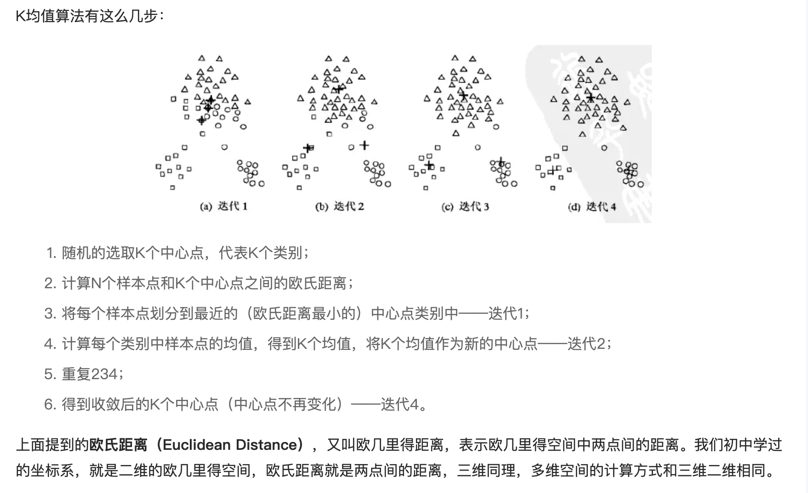
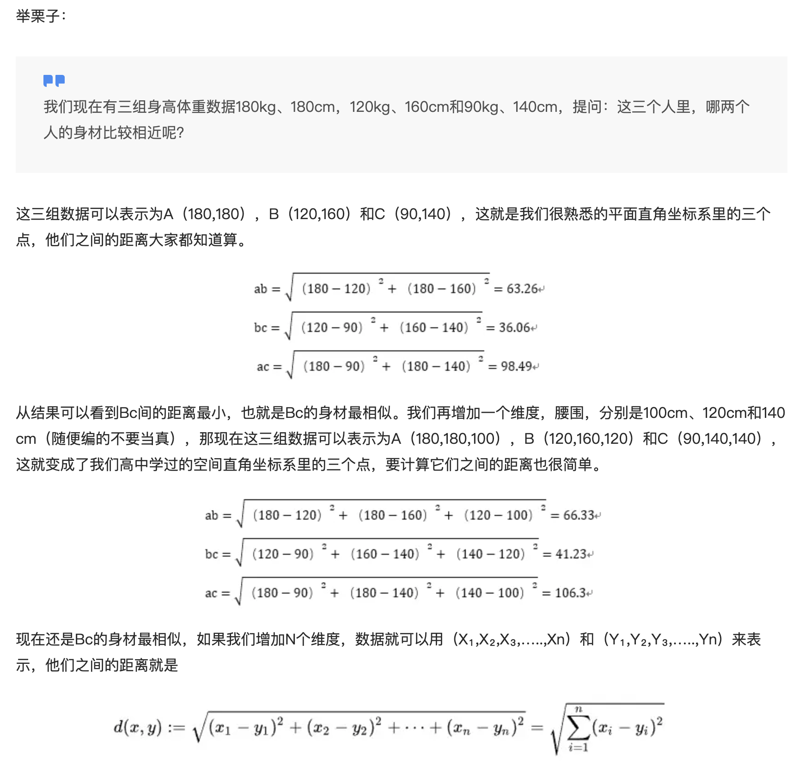
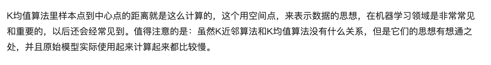

#### 本页目录

* [无监督学习](#无监督学习)
    * [EM（Expectation-Maximum）算法也称期望最大化算法]
    * 受限波尔兹曼机 
    * [聚类算法]()
        * [K均值聚类K-means](#K均值聚类K-means)
        * [层次聚类](#层次聚类)
    * [降维算法]()
        * [主成分分析 – PCA](#主成分分析)
        * [奇异值分解 – SVD](#奇异值分解)
        * [自编码器（Auto-encoder）]()
        * [GAN-深度学习]()
            

----

### K均值聚类K-means

