### 模型评估方法

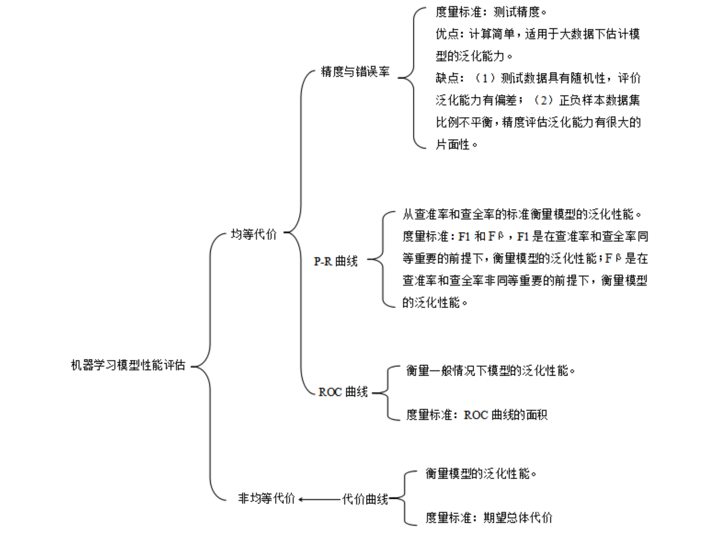

* 混淆矩阵 - 准确率(Accuracy),精确率(Precision),召回率(Recall)和 F1-Measure
* ROC曲线
* PR曲线
* `AUC`
* `logistic loss，logloss`对数损失

------
### 使用场景
* ROC曲线由于兼顾正例与负例，所以适用于评估分类器的整体性能，相比而言PR曲线完全聚焦于正例。 

* 如果有多份数据且存在不同的类别分布，比如信用卡欺诈问题中每个月正例和负例的比例可能都不相同，这时候如果只想单纯地比较分类器的性能且剔除类别分布改变的影响，则ROC曲线比较适合，因为类别分布改变可能使得PR曲线发生变化时好时坏，这种时候难以进行模型比较；反之，如果想测试不同类别分布下对分类器的性能的影响，则PR曲线比较适合。
* 如果想要评估在相同的类别分布下正例的预测情况，则宜选PR曲线。
* 类别不平衡问题中，ROC曲线通常会给出一个乐观的效果估计，所以大部分时候还是PR曲线更好。
* 最后可以根据具体的应用，在曲线上找到最优的点，得到相对应的precision，recall，f1 score等指标，去调整模型的阈值，从而得到一个符合具体应用的模型。

-----

#### 混淆矩阵

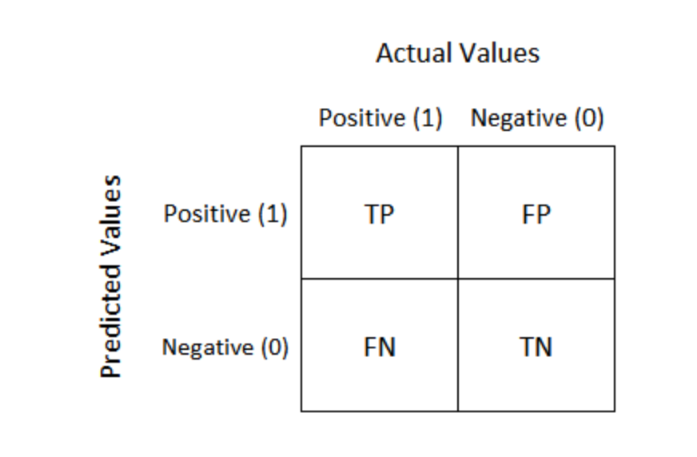

* True Positive: 预测为真，预测与事实相符
* True Negative: 预测为假，预测与事实相符
* False Positive: 预测为真，预测与事实相悖
* False Negative: 预测为假，预测与事实相悖

##### 计算方法：

* recall: 召回率
    * 召回率表示在真实为positive的样本中模型成功预测出的样本所占比例
    * 召回率只和真实为positive的样本相关，与真实为negative的样本无关；而精确率则受到两类样本的影响
    * 模型目标是使recall尽可能高

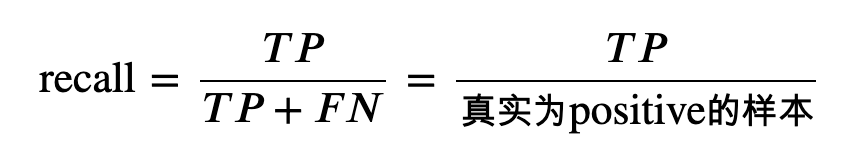

* Precision： 精确率
    * 精确率表示在预测为positive的样本中真实类别为positive的样本所占比例；

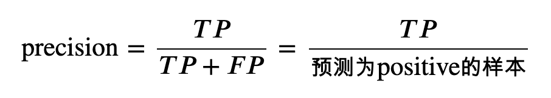

* accuracy: 准确率
    * 准确率表示预测正确的样本（TP和TN）在所有样本（all data）中占的比例。
    * 在数据集不平衡时，准确率将不能很好地表示模型的性能。可能会存在准确率很高，而少数类样本全分错的情况，此时应选择其它模型评价指标。
    * 同样，accuracy应该尽可能的高
 
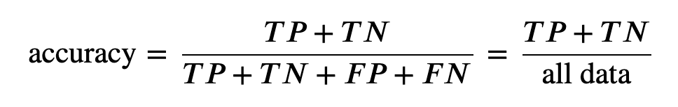

* F1 值
    * 同时测量召回率和精度
    * F1 值是精确率(Precision)和召回率(recall)的调和平均值
    * F1 认为精确率()Precision和召回率(recall)一样重要

* F𝛽方法：
    * 当𝛽为1是，此方法为F1方法，还有F2，F0.5等
    * 当𝛽>1时，𝐹𝛽认为召回率更重要
    * 当0<𝛽<1时，𝐹𝛽认为精确率更重要

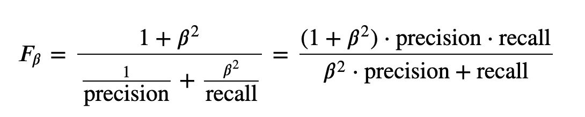

-----

#### ROC curve (receiver operating characteristic curve) 

* ROC曲线对于样本类别是否平衡并不敏感，即其并不受样本先验分布的影响，因此在实际工作中，更多的是用ROC/AUC来对模型的性能进行评价
* True Positive Rate (TPR) is a synonym for recall and is therefore defined as follows:

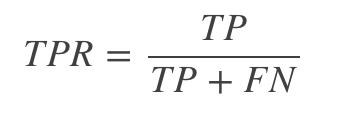

* False Positive Rate (FPR) is defined as follows:

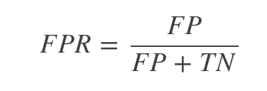

* ROC 曲线用于绘制采用不同分类阈值时的 TPR 与FPR。 降低分类阈值会导致将更多样本归为正类别，从而增加假正例和真正例的个数。下图显示了一个典型的 ROC 曲线。
* ROC曲线上的点可以使用不同的分类阈值进行多次评估模型，更有效的方法是使用ROC曲线下面积

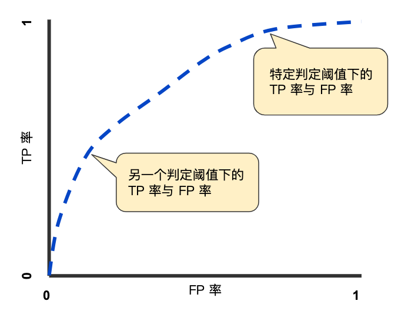

    (0,0)点：我们把所有的个体都预测为假，那我们可以知道TP与FP都为0，因为TP表示预测为真实际也为真，而FP表示预测为真实际为假的个体；
    (0,1)点：我们所有预测为真的个体都正确，这是我们最理想的情况，此时 TP=TP+FN，而 FP=0；
    (1,0)点：这是预测最糟糕的情况，即所有的预测都是错误的，那么此时 TP=0，而 FP=FP+TN；
    (1,1)点：因为其是在 y=x的这条直线上，因此其相当于随机预测，即我预测一个个体为真还是假都是随机的。

* 因此我们可以发现如果一个模型的ROC曲线越靠近与左上角，那么该模型就越优，其泛化性能就越好，
* 但是对于两个模型:
    * 如果模型A的ROC曲线完全包住了模型B 的ROC曲线，那么我们就认为模型A要优于模型B；
    * 如果两条曲线有交叉的话，我们就通过比较ROC与X，Y轴所围得曲线的面积来判断，面积越大，模型的性能就越优，这个面积我们称之为AUC(area under ROC curve)

* ROC 优点：
    * 兼顾正例和负例的权衡。因为TPR聚焦于正例，FPR聚焦于与负例，使其成为一个比较均衡的评估方法。
    * ROC曲线选用的两个指标， TPR和FPR，都不依赖于具体的类别分布。

* ROC 缺点：
    * ROC曲线的优点是不会随着类别分布的改变而改变，但这在某种程度上也是其缺点。因为负例N增加了很多，而曲线却没变，这等于产生了大量FP。像信息检索中如果主要关心正例的预测准确性的话，这就不可接受了。在类别不平衡的背景下，负例的数目众多致使FPR的增长不明显，导致ROC曲线呈现一个过分乐观的效果估计。ROC曲线的横轴采用FPR，根据公式，当负例N的数量远超正例P时，FP的大幅增长只能换来FPR的微小改变。结果是虽然大量负例被错判成正例，在ROC曲线上却无法直观地看出来。（当然也可以只分析ROC曲线左边一小段）

* TIP: 公式推导

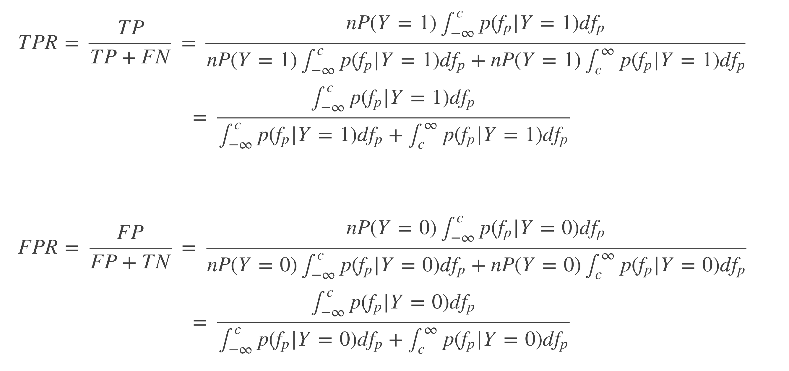

#### AUC (Area under the ROC Curve). 

* ROC曲线与坐标轴围成的面积即为AUC

* 曲线下面积对所有可能的分类阈值的效果进行综合衡量。曲线下面积的一种解读方式是看作模型将某个随机正类别样本排列在某个随机负类别样本之上的概率。以下面的样本为例，逻辑回归预测从左到右以升序排列
* 曲线下面积表示随机正类别（绿色）样本位于随机负类别（红色）样本右侧的概率。
    

* AUC 计算方法

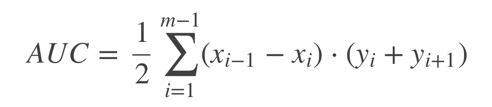

* 在AUC＞0.5的情况下，AUC越接近于1，说明诊断效果越好；
* AUC在0.5～0.7时有较低准确性，AUC在0.7～0.9时有一定准确性，AUC在0.9以上时有较高准确性。

* AUC 优势：
    * AUC is `scale-invariant`（尺度不变性）. It measures how well predictions are ranked, rather than their absolute values.
    * AUC is `classification-threshold-invariant`（分类阈值不变）. It measures the quality of the model's predictions irrespective of what classification threshold is chosen.测量模型质量与阈值无关。

* AUC 局限性
    * Scale invariance is not always desirable. For example, sometimes we really do need well calibrated probability outputs, and AUC won’t tell us about that. 无法得到良好校准的概率输出。
    * Classification-threshold invariance is not always desirable. In cases where there are wide disparities in the cost of false negatives vs. false positives, it may be critical to minimize one type of classification error. For example, when doing email spam detection, you likely want to prioritize minimizing false positives (even if that results in a significant increase of false negatives). AUC isn't a useful metric for this type of optimization.数据量不均衡，AUC失效。

#### Precision Recall（PR曲线）

* P-R曲线刻画查准率和查全率之间的关系，查准率指的是在所有预测为正例的数据中，真正例所占的比例，查全率是指预测为真正例的数据占所有正例数据的比例。

* 一般来说，查准率高时，查全率往往偏低，查全率高时，查准率往往偏低，

* PR曲线与ROC曲线的相同点是都采用了TPR(Recall)，都可以用AUC来衡量分类器的效果。不同点是ROC曲线使用了FPR，而PR曲线使用了Precision，因此PR曲线的两个指标都聚焦于正例。类别不平衡问题中由于主要关心正例，所以在此情况下PR曲线被广泛认为优于ROC曲线。

* PR曲线的绘制与ROC曲线类似，PR曲线的AUC面积计算公式为：

------

#### Cost curve 损失曲线

* 代价曲线的作用就是找到一个最合适的阈值，使得分错的情况最少。

* Cost curve 相比ROC，优势：
    * Cost curve 能可视化代价。
    * Cost curve 的纵轴给出了我们对模型最关心的指标：代价或者错误率。且撇开 ROC 的短板 —— 代价不说，仅就错误率而言，CC 上一目了然的事情，在 ROC 空间里并不方便，每拉出一个点，至少得心算一次加法，一次减法。
    * Cost curve 的纵轴与先验 [公式] 直接相关。通常情况下，先验与样本中的频率并不相同。CC 可以展示模型在各个 [公式] 情况下的表现，也是 ROC 所不及的。

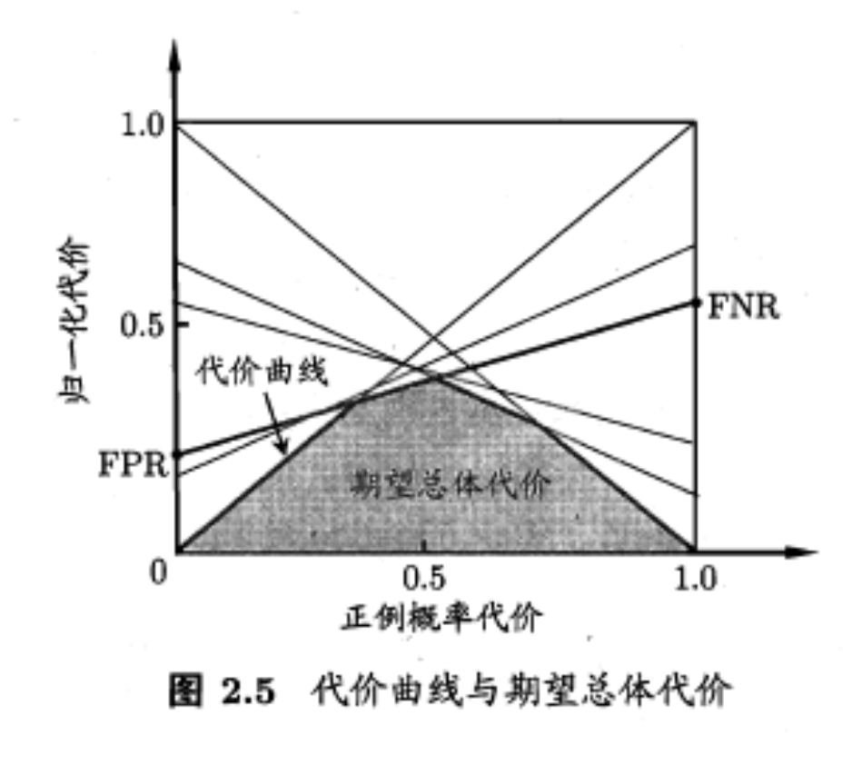

* 图中多条线段含义：
    * 每一条线段实际上就是一组(FPR,FNR)组合决定的。而一组(FPR,FNR)又是由阈值决定的，不同的阈值就会有不同的(FPR,FNR)。
    * 在ROC曲线时，我们取了11个阈值，就应该由11个(FPR,FNR)的组合，就应该绘制11条线段。

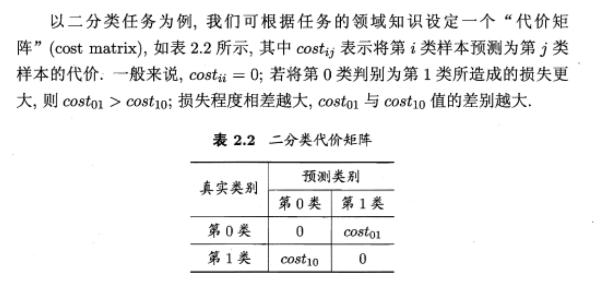

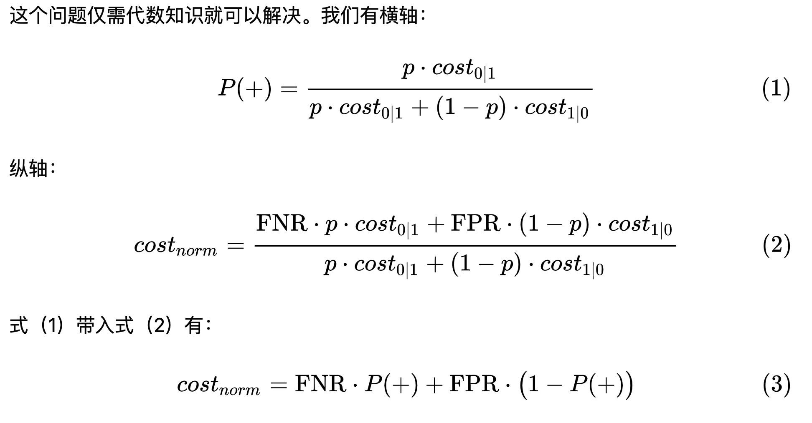

* FNR表示正例中有多少被预测错了，变成了负例
* FPR：表示负例中有多少预测错了，变成了正例
* P(+):表示，你现在有的样本中，正例的比例，如果是之前方块的例子，P(+)就是0.7。

* 当我们认为，正例错判为负例的代价与负例错判为正例的代价相同时， P(+) = P。
* 当我们认为把`负类判定为正类会造成更大的损失时`，此时Cost10 > Cost01，带入公式1, 得 P2(+) ，这时候就有 P2(+) < P1(+)。
* 对应到上图中， 正例概率 P(+)  就会往左移动，对应的阈值就会增大，模型对正类的判断就会更谨慎。

* 归一化代价。事实上这个东西就是错误率，
* 首先，横坐标是P(+)，由公式3可以知道，当P(+)=0时， Cost_norm = FPR；当P(+)=1时， Cost_norm = FNR。即，当我用来检测模型好坏的样本全是负例（即P(+)=0）,那我模型产生的错误就只有负例被错误的预测为正例这一种情况，就是(0,FPR)的由来！
* 同样，当我用来检测模型好坏的样本全都是正例（即P(+)=1）,那我模型产生的错误就只有正例被错误的预测为负例的情况这一种情况，就是(1,FNR)的由来！
* 两个连线中间的情况，用来检测模型的样本有正例也有负例的时候，也就是P(+)=0.x，这时候 Cost_norm 的取值就会同时受到FPR和FNR的影响。
* 因为FPR，FNR都是样本被分错的情况，本质也是错误率。

-------

#### 画ROC曲线

1. 设置第一个阈值
    * 当我们设置阈值为0.90时，模型 M 打分 > 0.90则为好方块， <= 0.90则为坏方块。在我们10个方块中的表现为：只有0方块为好方块，其余9个方块都为坏方块如图
    * 计算得到一组（FPR，TPR）值，并将其画在ROC曲线图中
    
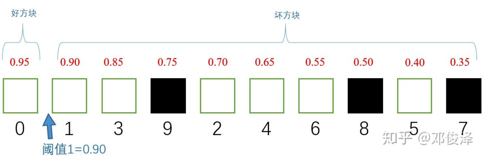

2. 设置第二个阈值
    * 同样，当我们设置阈值为0.85时，情况如下
    * 再次得到一组（FPR，TPR）值，并将其画在ROC曲线图中

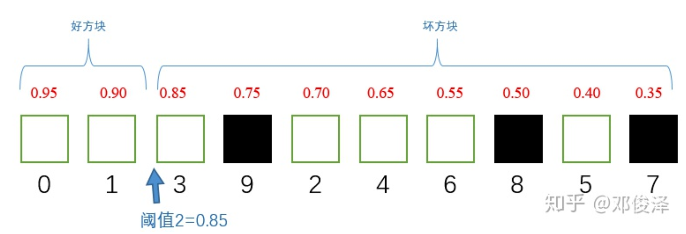

3. 连续设置11个阈值
    * 计算得到11组（FPR，TPR）值，将其画到ROC曲线图中，如图

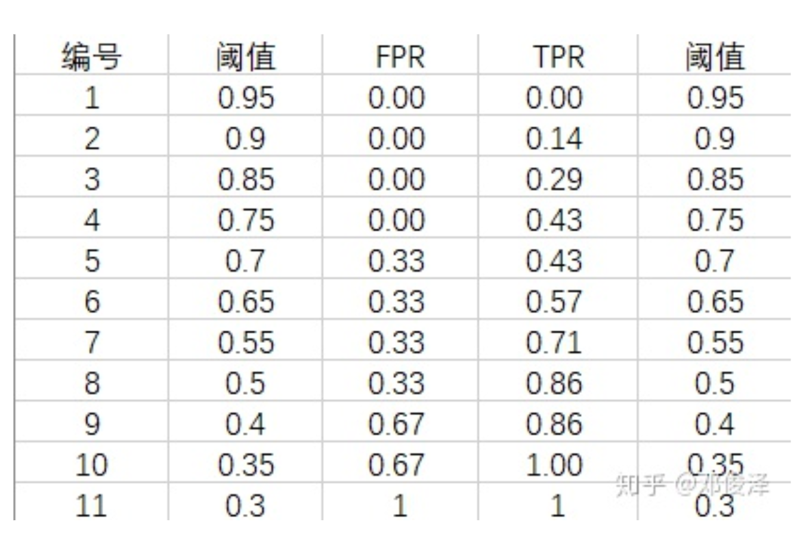

* 将其画到ROC曲线图中，如图：

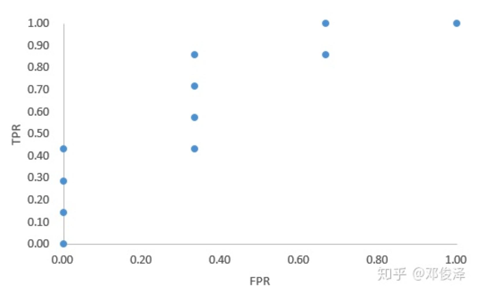

* 将离散的点使用线性插值的方式连接，得到ROC曲线，如图：

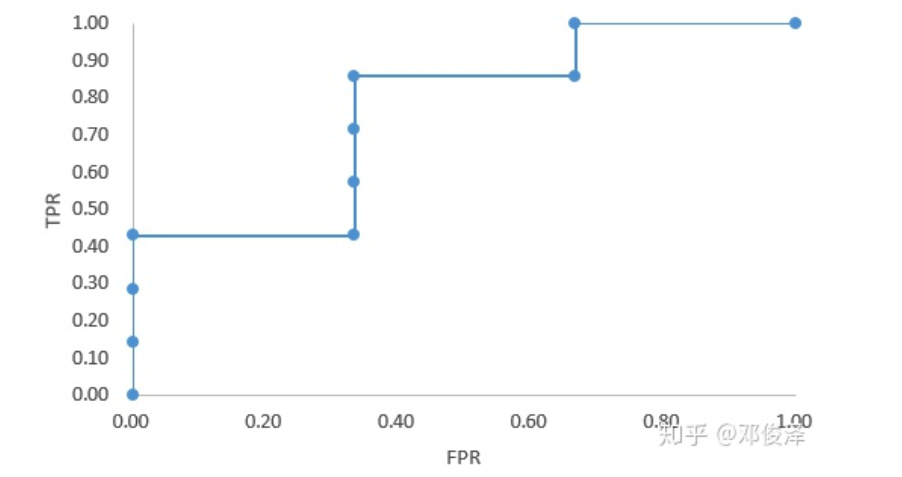

