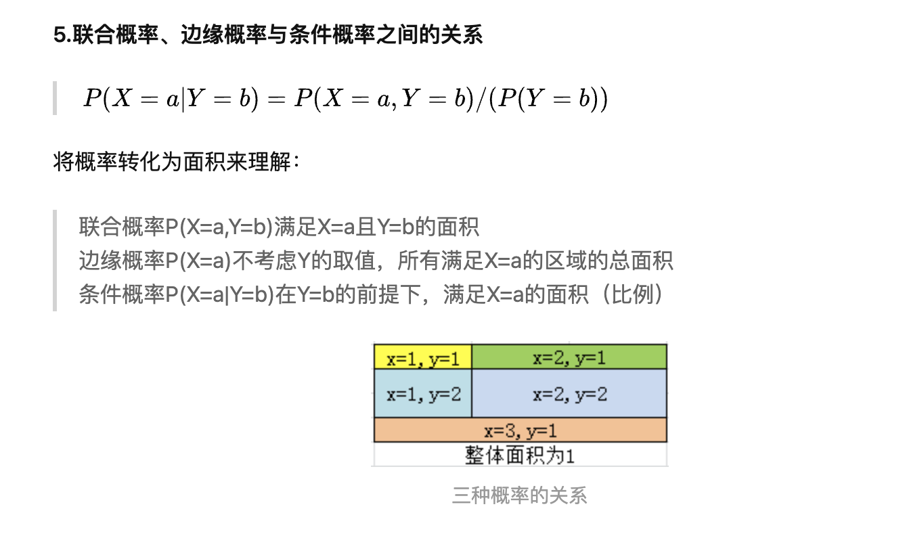
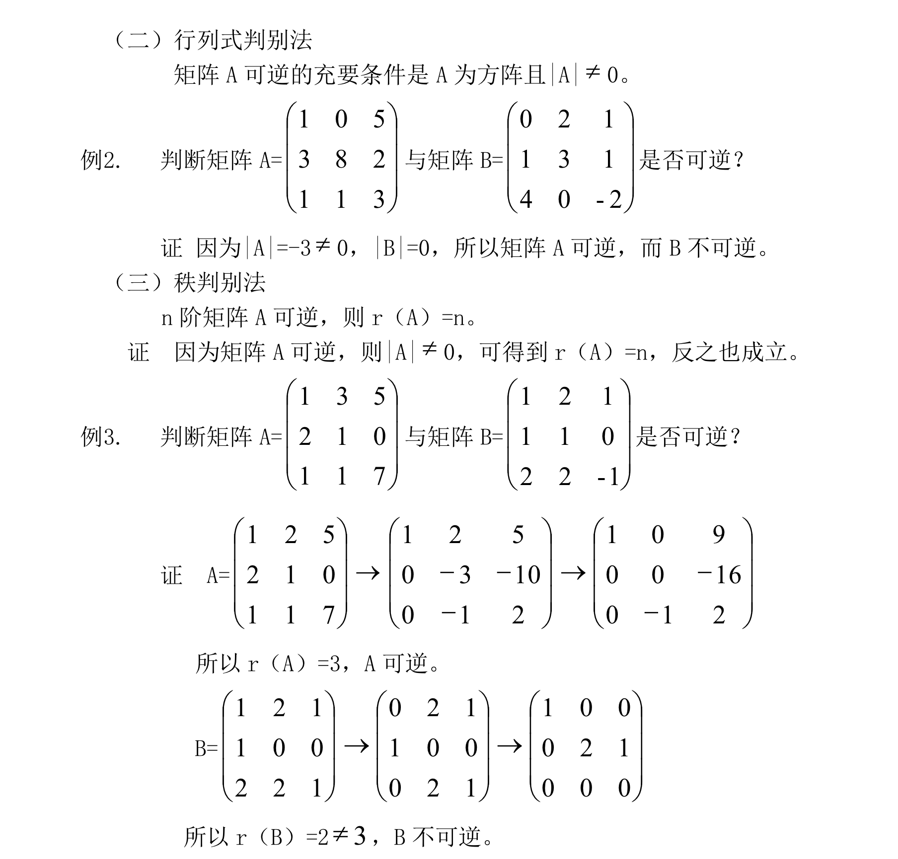

## 机器学习数学基础
------
### 目录
* [概率统计](#概率统计)
    * [概率核心理论](#概率核心理论)
    * [核心的几种随机变量的分布以及变量之间的关系](#核心的几种随机变量的分布以及变量之间的关系)
    * [参数估计理论](#参数估计理论)
    * [随机理论的相关概念](#随机理论的相关概念)
    * [信息论](#信息论)
    * [随机过程初步理论和应用](#随机过程初步理论和应用)
    * [时间序列分析](#时间序列分析)
* [线性代数](#线性代数)
    * [矩阵基本计算](#矩阵基本计算)
    * [行列式](#行列式)
    * [矩阵的逆矩阵](#矩阵的逆矩阵)
    * [矩阵求导](#矩阵求导)

-------

### 概率统计

#### 概率核心理论
[主要参考 及 例子](https://www.shangyang.me/2019/03/21/math-probability-04-conditional-probability/)

* ##### 经典分布

[分布参考](https://blog.csdn.net/qq_28168421/article/details/103998235)

均匀分布（连续）伯努利分布（离散）二项分布（离散）多伯努利分布，分类分布（离散）多项式分布（离散）
β分布（连续）Dirichlet 分布（连续）伽马分布（连续）指数分布（连续）高斯分布（连续）正态分布（连续）
卡方分布（连续）t 分布（连续）

* ##### 期望 方差

* ##### 条件概率 和 全概率

* ##### 联合概率 和 边缘概率

* ##### 贝叶斯公式

[肝癌检测报告 例子](https://www.shangyang.me/2019/03/21/math-probability-04-conditional-probability/)

* ##### 朴素贝叶斯

[朴素贝叶斯参考](https://www.cnblogs.com/pinard/p/6069267.html)
[朴素贝叶斯参考](https://www.pkudodo.com/2018/11/21/1-3/)
[朴素贝叶斯参考](https://www.bioinfo-scrounger.com/archives/737/)
[朴素贝叶斯参考](https://blog.csdn.net/fisherming/article/details/79509025)

#### 核心的几种随机变量的分布以及变量之间的关系
分布的期望、方差等数字特征，了解概率密度函数和累积分布函数。对多组不同的变量，熟悉协方差以及相关性的意义和计算方法。

#### 参数估计理论
需要重点掌握最小偏差无偏估计、最大似然估计和贝叶斯估计的相关内容。并且学习EM算法。

#### 随机理论的相关概念
掌握蒙特卡罗方法的基本思想。同时巩固贝叶斯的思想方法，接触一下马尔科夫蒙特卡洛（MCMC）算法，找一找处理实际问题的感觉。

#### 信息论
学习关于熵的一些理论，联合熵、条件熵、交叉熵、相对熵、互信息等概念，以及最大熵模型。
[参考](https://www.cnblogs.com/qizhou/p/12178082.html)

#### 随机过程初步理论和应用
首先马尔科夫链是必须学习的，了解状态转移矩阵、多步转移、几种不同的状态分类、平稳分布等最基本的内容。然后在此概念基础上，学习隐马尔科夫链的相关内容，聚焦其基本概念，以及概率计算和参数学习的一些方法。

#### 时间序列分析
重点是移动平均、相关性以及预测等内容。

-----------

### 线性代数

#### 矩阵基本计算

#### 行列式

#### 矩阵的逆矩阵

#### 矩阵求导

--------

