### Deep Learning
* [深度学习 - 神经网络](#)
    * [Specific artificial neural networks](#Specific%20artificial%20neural%20networks)
    * [学习方式](#学习方式)
    * [LDF (Linear Discriminant Functions) 线性二分方程](#)
        * [Perceptron Learning](#Perceptron%20Learning)
        * [Minimum Squared Error Learning (Widrow-Hoff) - 最小二乘错误学习](#)
        * [Delta Learning Rule （supervised）](#)
        * [Hebbian learning rule （unsupervised）](#)
    * [必备网络](#必备网络)
---

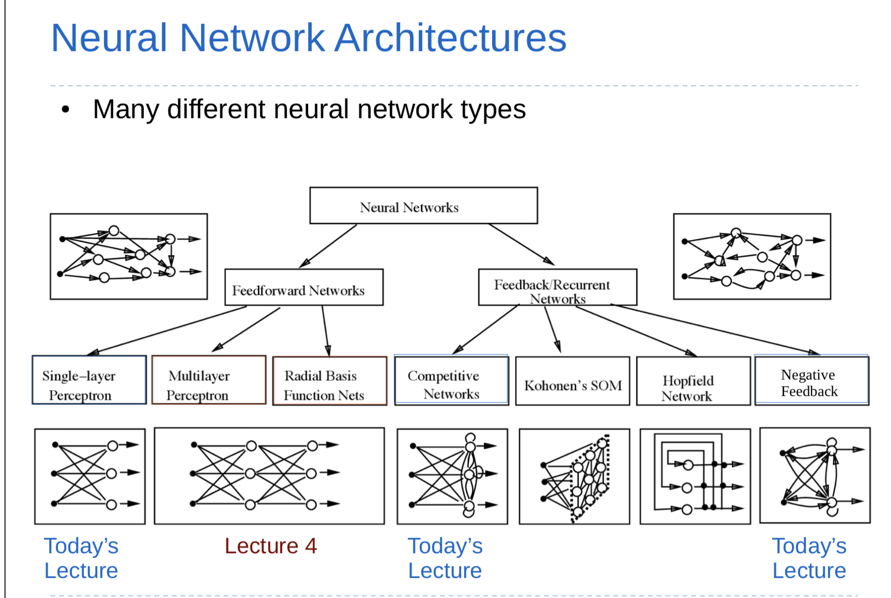

----

### 神经网络发展分类

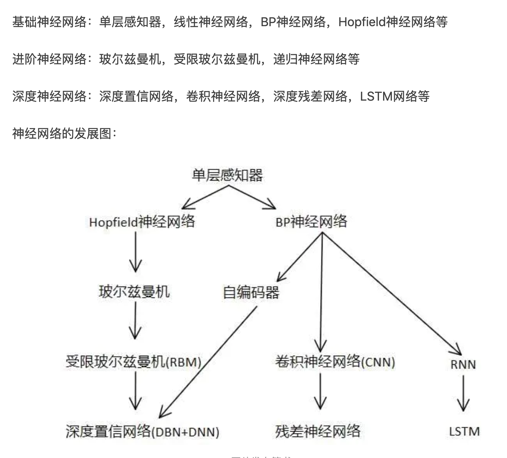

----
#### Specific artificial neural networks

* generic artificial neural network    -   遗传神经网络
* Linear Threshold Unit (or Perceptron)   - 感知机 又称 基于LTN的人工神经元
* Competitive Learning Networks -   竞争学习神经网络
* Inhibitory Feedback Networks  -   抑制反馈网络
* Autoencoder Networks  -   自编码网络
* Multilayer Perceptrons    -   多层感知机
* Radial Basis Function Networks    -   径向基函数神经网络
* Convolutional Neural Networks -   卷积神经网络
* Restricted Boltzmann Machines -   受限玻尔兹曼机
* Hopfield Networks -   一种单层反馈神经网络
* Kohonen Networks  -  自组织特征映射 SOM(Self-organizing feature Map）
* Capsule Networks  -   胶囊网络

-----

#### 学习方式

##### LDF (Linear Discriminant Functions) 线性二分方程：

* Perceptron Learning
    * 感知机学习的数据是线性可分的，若给定一组含有正负样本的数据，若可以找到一个超平面，将其完美的分为两类，即一侧为正样本，一侧为负样本，那么这组数据即为线性可分的。
    * 学习策略
        * 首先假设数据是线性可分的，那么我们就需要找到一个超平面(一组 w,b )将数据分开。

        * 定义损失函数，则希望这个损失函数越小越好，即完美分割的平面损失函数值最小。

        * 误分类的点离这个超平面越近，则说明`误分类的程度越小`，故可将损失函数定义为误分类点到超平面的距离和
            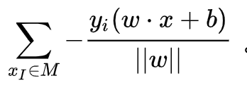

        * 然而此时我们只在这只值的大小，不考虑分母未知 w 的L2范数也是可以的，显然， L(w,b) 为非负函数。即定义为
            

    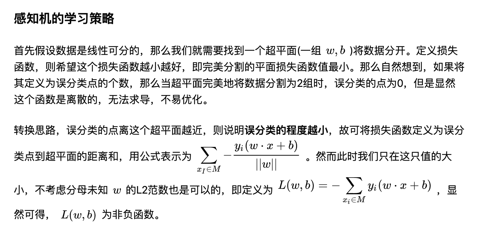

    * 算法形式 
        1. 明确优化目标
            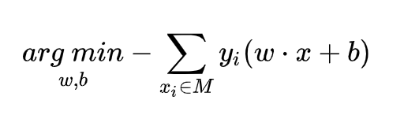
            
        2. 感知机学习算法是误分类驱动的，可以采用梯度下降算法。假定误分类点集合 M 是固定的，损失函数的 L(w,b) 的梯度由下面两个式子确定。
            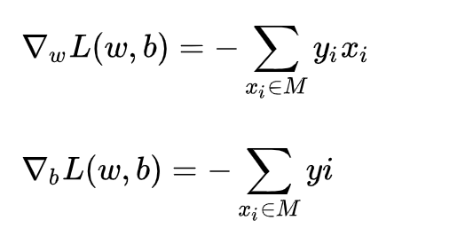
            
        3. 对于误分类点，进行一下迭代更新
            
            
        4. 其中 η 为步长，也被称为学习率，这样迭代可以使得损失函数 L(w,b) 不但减小，直至为0为止。
        
        5. 使用梯度下降更新模型，也只是对那些误分类的样本更新，对已经正确分类的样本则不用更新。
    
    

    * 梯度下降的种类 （具体算法在启发式算法中）
        * 批量梯度下降（Batch Gradient Descent）
            批量梯度下降中，单次迭代使用全部的训练集样本来更新模型。当训练集非常大的时候，会十分耗时，他的优点也非常明显，收敛快，迭代次数少。
            
        * 随机梯度下降（Stochastic gradient descent）
            为了克服BGD带来的训练速度慢的问题，提出了SGD方法。随机梯度下降中，单次迭代随机选择训练集中的一个样本来更新模型，同时也带来了问题，由于有噪音的问题，单次迭代可能不会朝着优化的方向进行，但是可以说总体是朝着更优的方向移动的。
            
        * 小批量梯度下降（Mini-Batch Gradient Descent)
            小批量梯度下降是为了折中上面的两种算法，即每次既不用一个，也不用全部训练集来更新模型，而是选择一部分来更新模型。这样既可以保证模型的训练速度，又可以保证参数的准确性。
        
        * 口袋算法（Pocket Algorithm）
            感知机模型是针对可以线性可分的数据进行的，若不可线性可分，则会算法会一直运行下去。为了解决这个问题，STEPHEN I. GALLANT在论文《Perceptron-Based Learning Algorithms》中提出了Pocket Algorithm。
            
            * Pocket Algorithm的基本思想为，在感知机求解超平面的过程中，保存当前的最优解，即使得测试集误分类样本最少的 [公式] 的值，当超过迭代次数后，算法输出保存的最优解。为了求解出这个解，则必须在单次迭代后，遍历一遍训练集，找出对于当前的模型有多少误分类的样本数，增大了开销。
            
            * 相比之下，感知机自动收敛到最优结果（当然要求线性可分，否则停不下来），使用口袋算法的感知机则设定最大迭代次数，输出迭代过程中的最优结果。

* Minimum Squared Error Learning (Widrow-Hoff) - 最小二乘错误学习
    * MSE是衡量“平均误差”的一种较方便的方法，MSE可以评价数据的变化程度，MSE的值越小，说明预测模型描述实验数据具有更好的精确度。
    

* Delta Learning Rule （supervised）

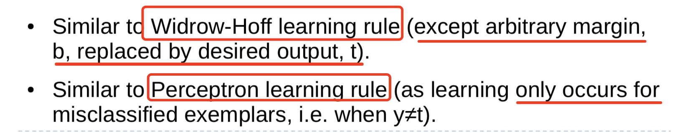

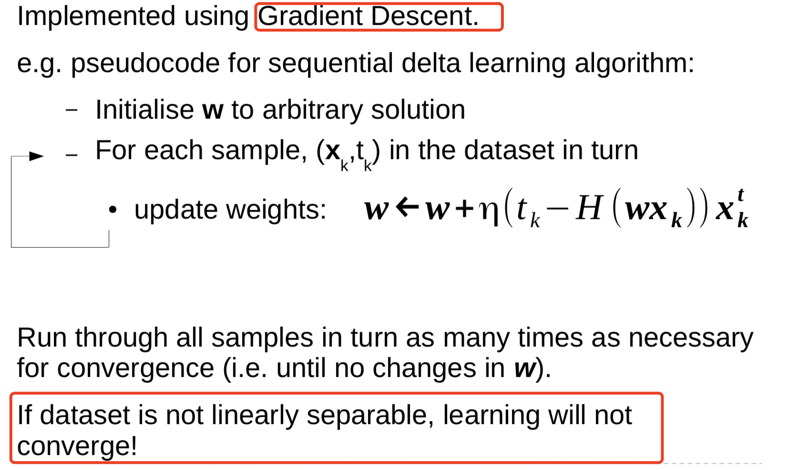
    * Sequential Delta Learning Algorithm 例子
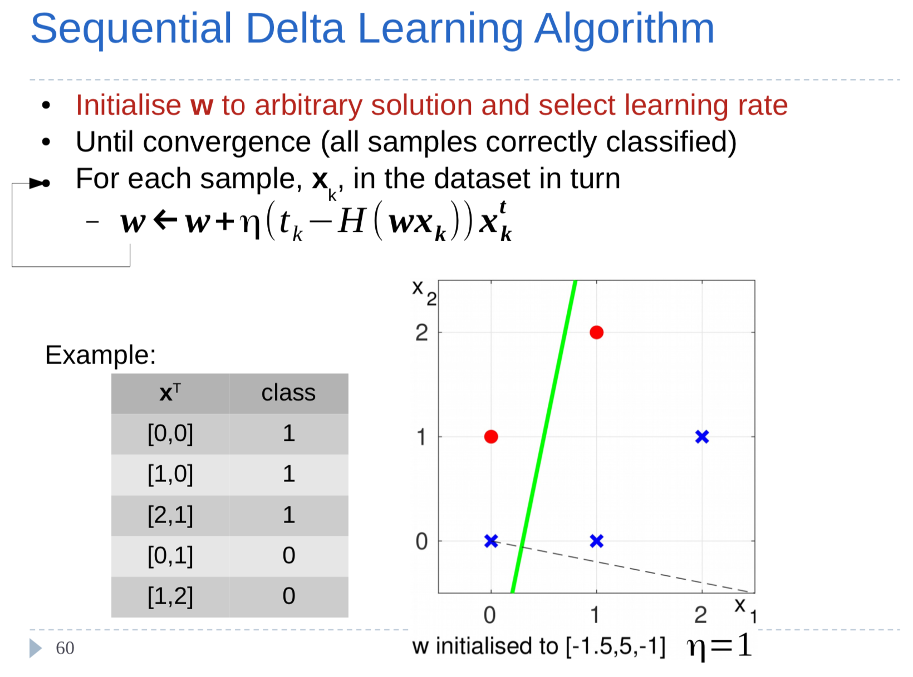
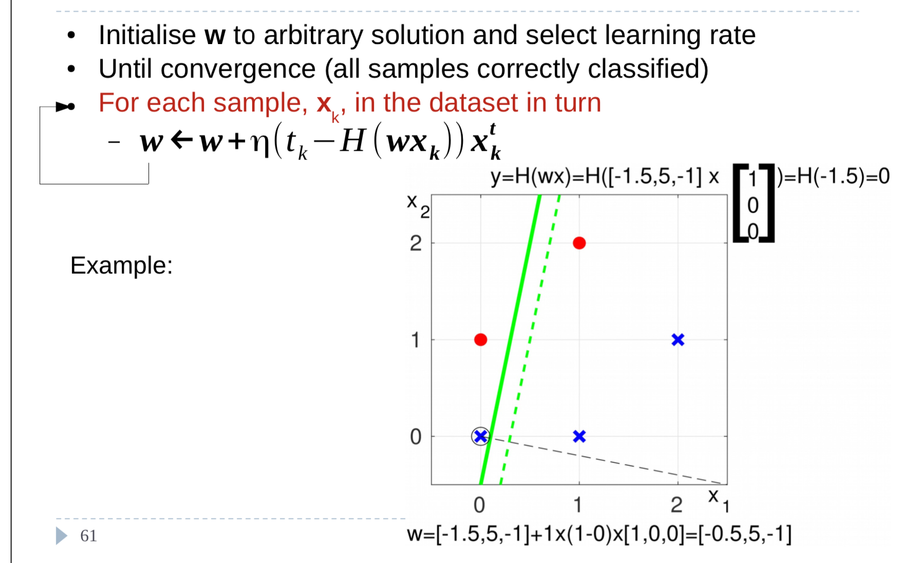
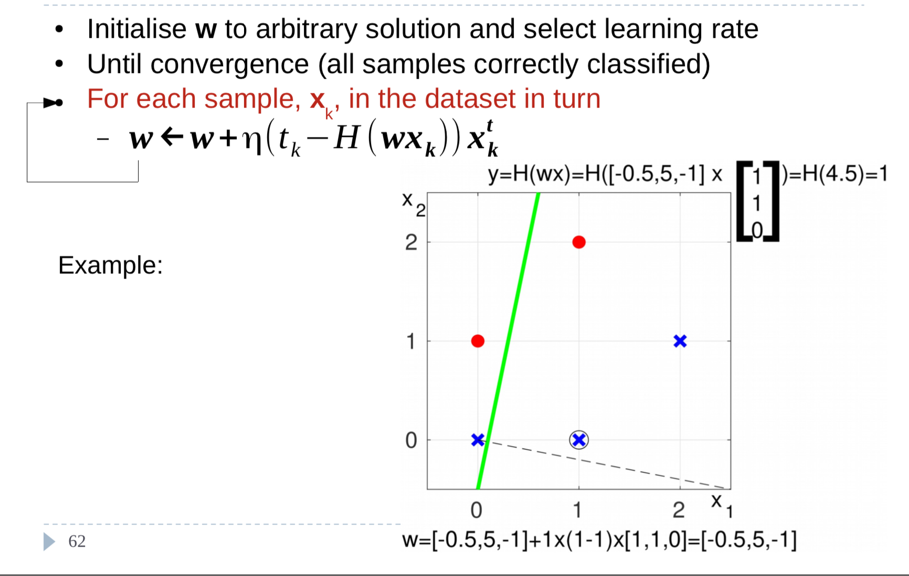
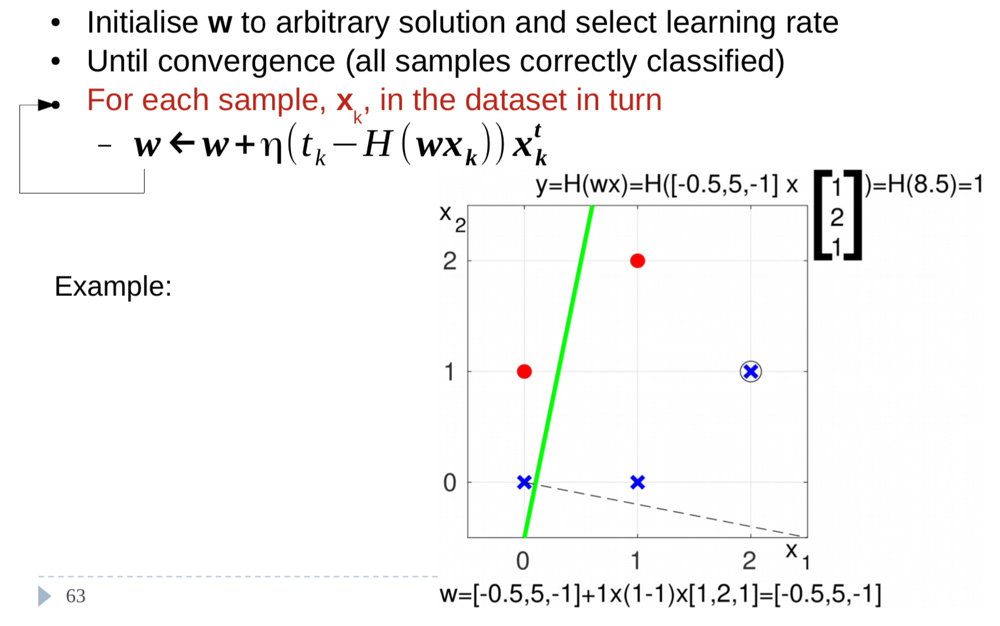

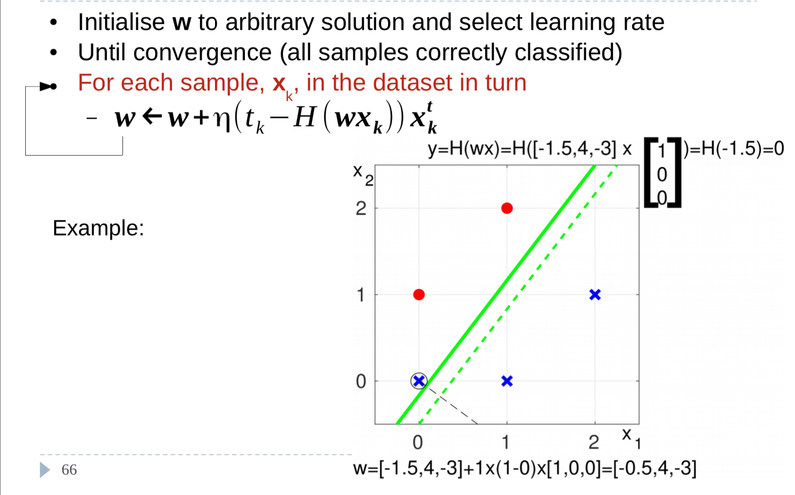

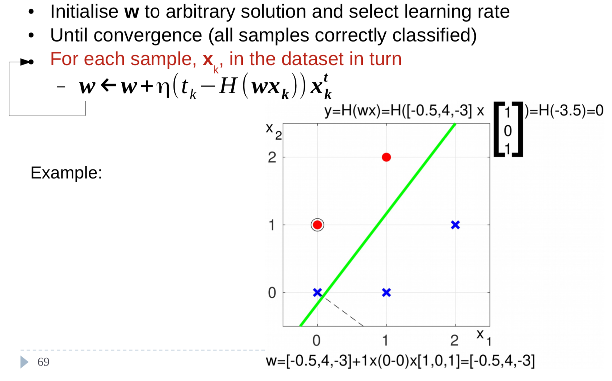

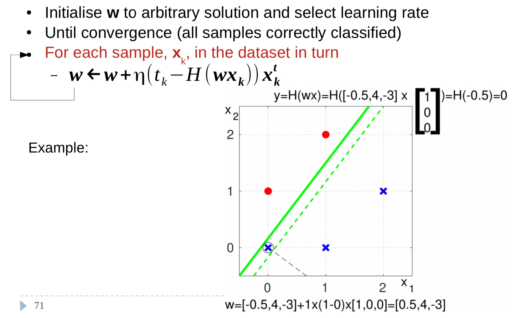

* Hebbian learning rule （unsupervised）

----

#### 必备网络

* 感知机
* 卷积神经网络
* 循环神经网络
* 长短期记忆网络
* 玻尔兹曼机网络
* 深度信念网络
* 深度自动编码器
* BP神经网络

-----

