### 目标检测
-----

#### 重要算法模型

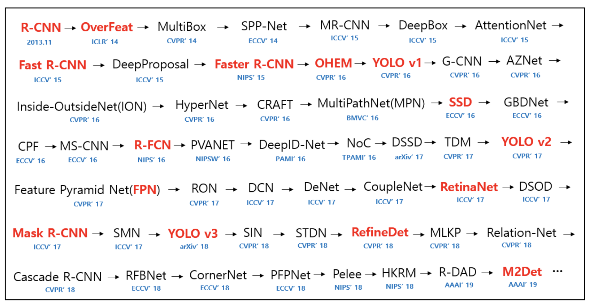

------

#### 必备模型

一个完整的目标检测网络主要由三部分构成：detector=backbone+neck+head

新的监测网络使用 Transformer ，如： Detection Transformer

Faster R-CNN
RetinaNet 

resent 
senet
frp，
rpn，
nms，
roi align ，
sppnet，
rcnn系列，
yolov系列，
ssd系列

--------

### Single Shot MultiBox Detector (SSD) 
https://zhuanlan.zhihu.com/p/33544892
https://github.com/xiaohu2015/DeepLearning_tutorials/tree/master/ObjectDetections/SSD

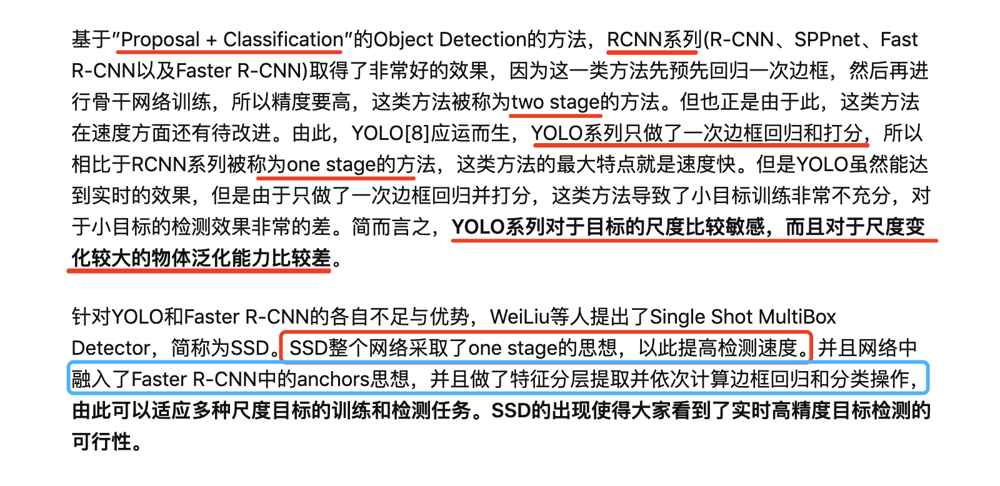
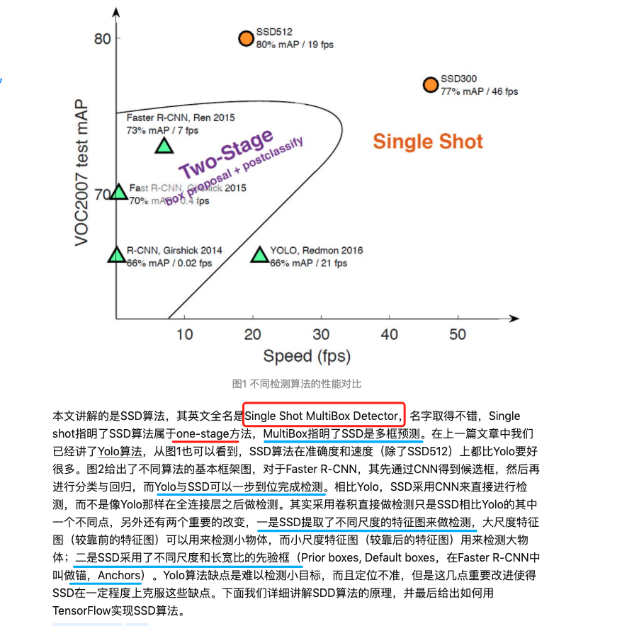
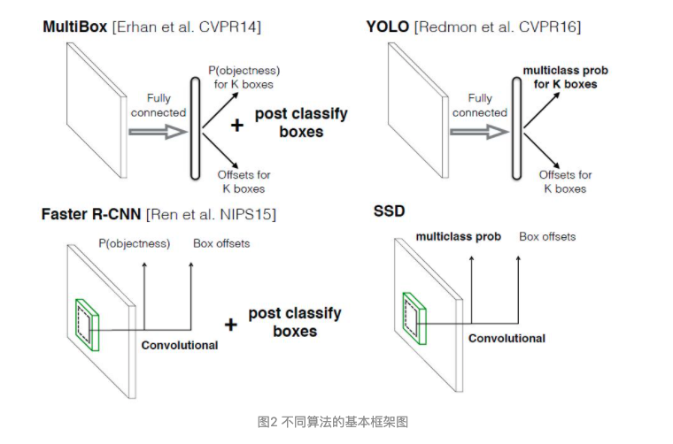
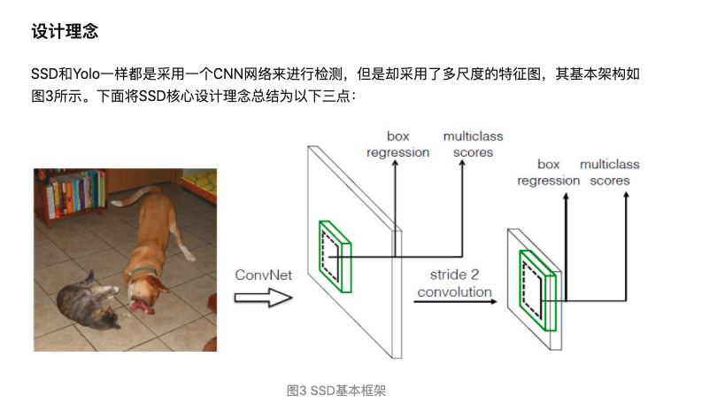
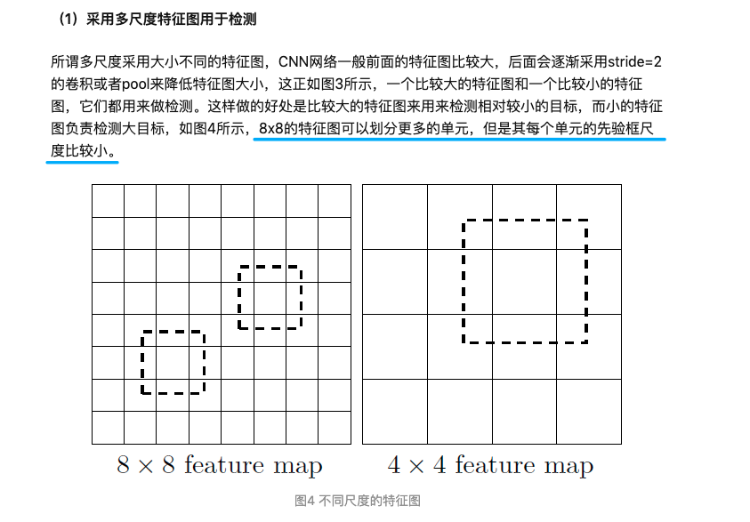
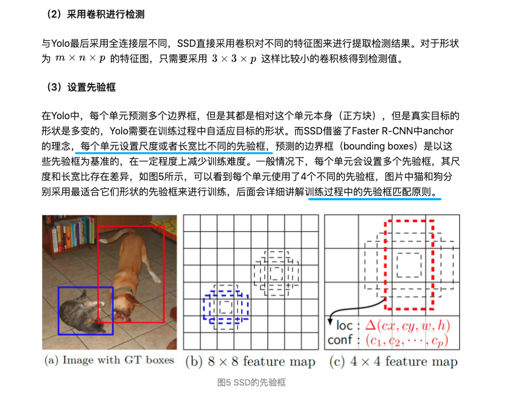
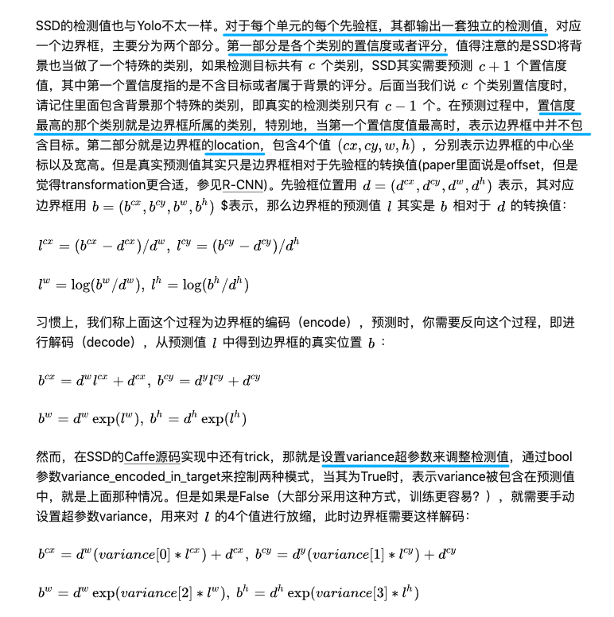
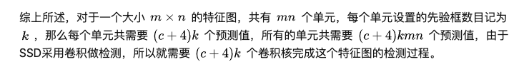
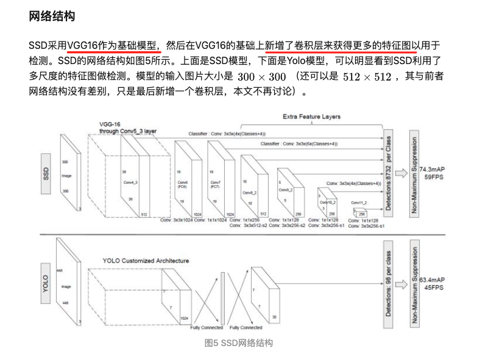
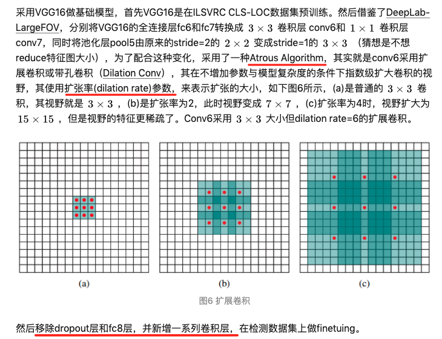
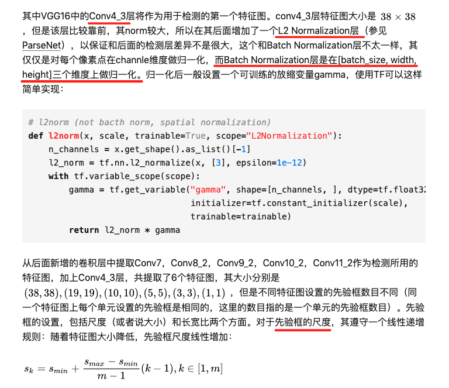
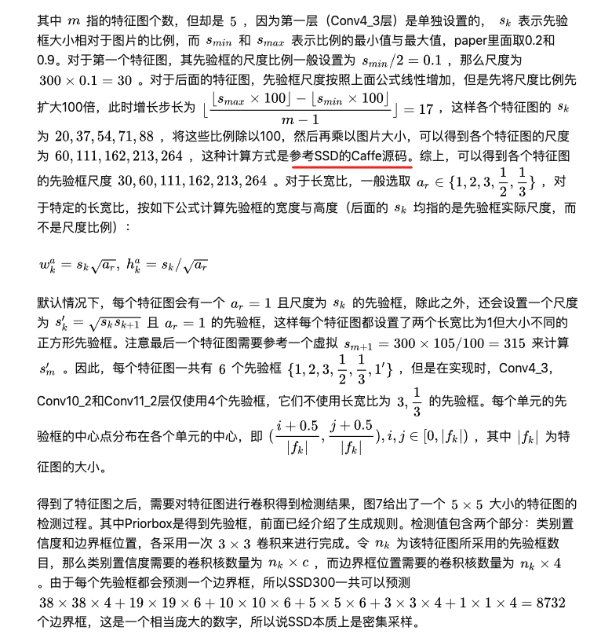
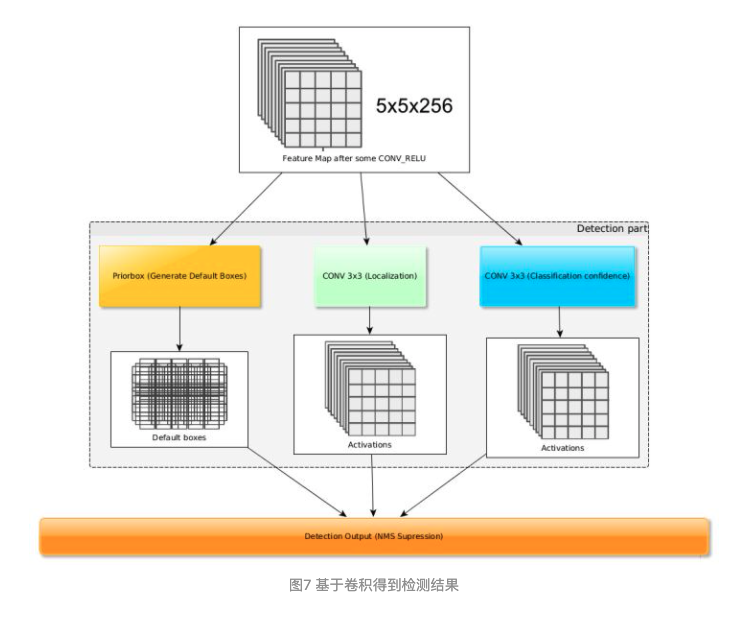
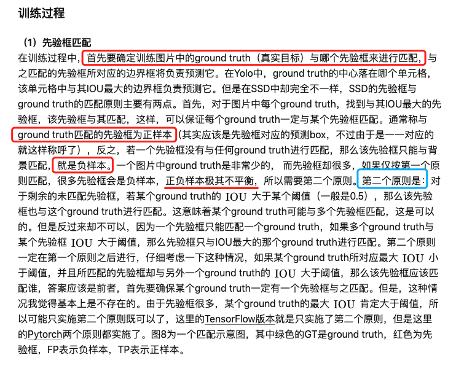

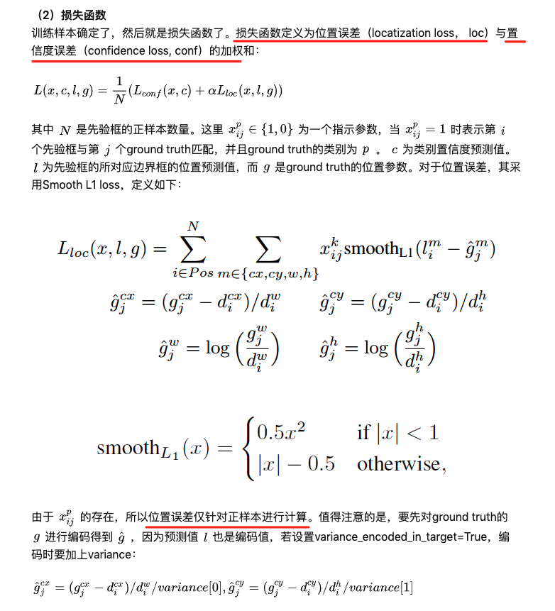
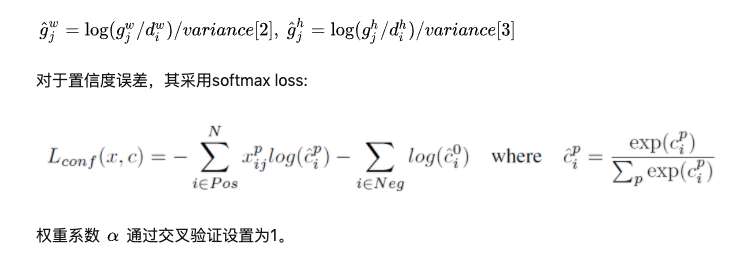
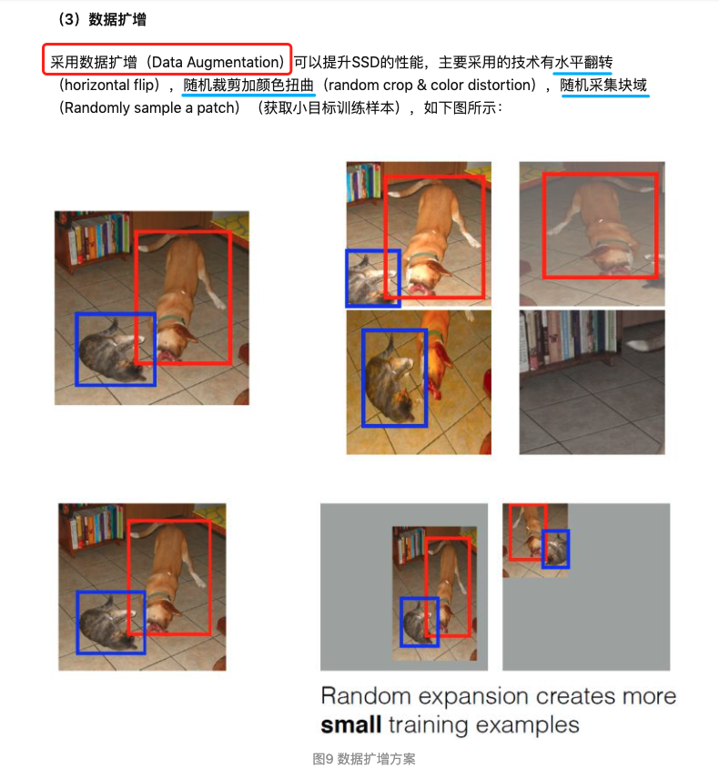
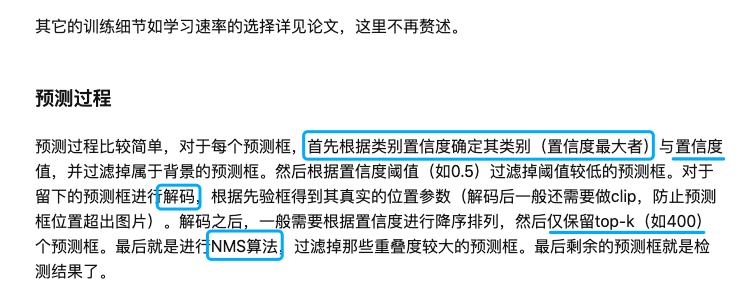
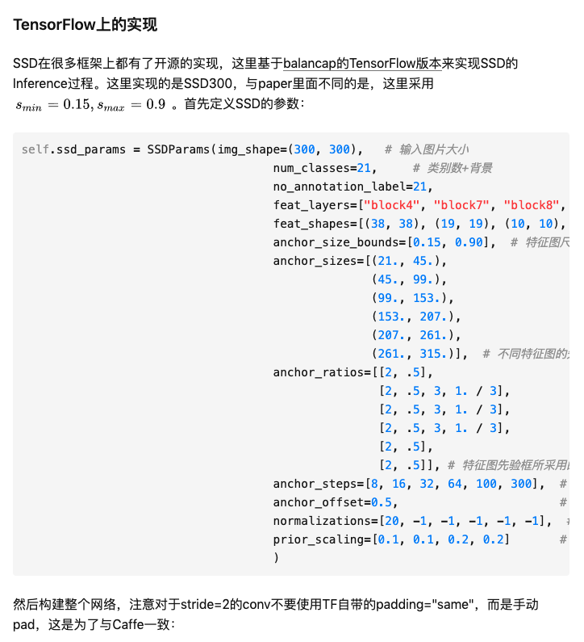

    
    self.ssd_params = SSDParams(img_shape=(300, 300),   # 输入图片大小
                                        num_classes=21,     # 类别数+背景
                                        no_annotation_label=21,
                                        feat_layers=["block4", "block7", "block8", "block9", "block10", "block11"],   # 要进行检测的特征图name
                                        feat_shapes=[(38, 38), (19, 19), (10, 10), (5, 5), (3, 3), (1, 1)],  # 特征图大小
                                        anchor_size_bounds=[0.15, 0.90],  # 特征图尺度范围
                                        anchor_sizes=[(21., 45.),
                                                      (45., 99.),
                                                      (99., 153.),
                                                      (153., 207.),
                                                      (207., 261.),
                                                      (261., 315.)],  # 不同特征图的先验框尺度（第一个值是s_k，第2个值是s_k+1）
                                        anchor_ratios=[[2, .5],
                                                       [2, .5, 3, 1. / 3],
                                                       [2, .5, 3, 1. / 3],
                                                       [2, .5, 3, 1. / 3],
                                                       [2, .5],
                                                       [2, .5]], # 特征图先验框所采用的长宽比（每个特征图都有2个正方形先验框）
                                        anchor_steps=[8, 16, 32, 64, 100, 300],  # 特征图的单元大小
                                        anchor_offset=0.5,                       # 偏移值，确定先验框中心
                                        normalizations=[20, -1, -1, -1, -1, -1],  # l2 norm
                                        prior_scaling=[0.1, 0.1, 0.2, 0.2]       # variance
                                        )

    def _built_net(self):
            """Construct the SSD net"""
            self.end_points = {}  # record the detection layers output
            self._images = tf.placeholder(tf.float32, shape=[None, self.ssd_params.img_shape[0],
                                                            self.ssd_params.img_shape[1], 3])
            with tf.variable_scope("ssd_300_vgg"):
                # original vgg layers
                # block 1
                net = conv2d(self._images, 64, 3, scope="conv1_1")
                net = conv2d(net, 64, 3, scope="conv1_2")
                self.end_points["block1"] = net
                net = max_pool2d(net, 2, scope="pool1")
                # block 2
                net = conv2d(net, 128, 3, scope="conv2_1")
                net = conv2d(net, 128, 3, scope="conv2_2")
                self.end_points["block2"] = net
                net = max_pool2d(net, 2, scope="pool2")
                # block 3
                net = conv2d(net, 256, 3, scope="conv3_1")
                net = conv2d(net, 256, 3, scope="conv3_2")
                net = conv2d(net, 256, 3, scope="conv3_3")
                self.end_points["block3"] = net
                net = max_pool2d(net, 2, scope="pool3")
                # block 4
                net = conv2d(net, 512, 3, scope="conv4_1")
                net = conv2d(net, 512, 3, scope="conv4_2")
                net = conv2d(net, 512, 3, scope="conv4_3")
                self.end_points["block4"] = net
                net = max_pool2d(net, 2, scope="pool4")
                # block 5
                net = conv2d(net, 512, 3, scope="conv5_1")
                net = conv2d(net, 512, 3, scope="conv5_2")
                net = conv2d(net, 512, 3, scope="conv5_3")
                self.end_points["block5"] = net
                print(net)
                net = max_pool2d(net, 3, stride=1, scope="pool5")
                print(net)
    
                # additional SSD layers
                # block 6: use dilate conv
                net = conv2d(net, 1024, 3, dilation_rate=6, scope="conv6")
                self.end_points["block6"] = net
                #net = dropout(net, is_training=self.is_training)
                # block 7
                net = conv2d(net, 1024, 1, scope="conv7")
                self.end_points["block7"] = net
                # block 8
                net = conv2d(net, 256, 1, scope="conv8_1x1")
                net = conv2d(pad2d(net, 1), 512, 3, stride=2, scope="conv8_3x3",
                             padding="valid")
                self.end_points["block8"] = net
                # block 9
                net = conv2d(net, 128, 1, scope="conv9_1x1")
                net = conv2d(pad2d(net, 1), 256, 3, stride=2, scope="conv9_3x3",
                             padding="valid")
                self.end_points["block9"] = net
                # block 10
                net = conv2d(net, 128, 1, scope="conv10_1x1")
                net = conv2d(net, 256, 3, scope="conv10_3x3", padding="valid")
                self.end_points["block10"] = net
                # block 11
                net = conv2d(net, 128, 1, scope="conv11_1x1")
                net = conv2d(net, 256, 3, scope="conv11_3x3", padding="valid")
                self.end_points["block11"] = net
    
                # class and location predictions
                predictions = []
                logits = []
                locations = []
                for i, layer in enumerate(self.ssd_params.feat_layers):
                    cls, loc = ssd_multibox_layer(self.end_points[layer], self.ssd_params.num_classes,
                                                  self.ssd_params.anchor_sizes[i],
                                                  self.ssd_params.anchor_ratios[i],
                                                  self.ssd_params.normalizations[i], scope=layer+"_box")
                    predictions.append(tf.nn.softmax(cls))
                    logits.append(cls)
                    locations.append(loc)
                return predictions, logits, locations

对于特征图的检测，这里单独定义了一个组合层ssd_multibox_layer，其主要是对特征图进行两次卷积，分别得到类别置信度与边界框位置：
    
    # multibox layer: get class and location predicitions from detection layer
        def ssd_multibox_layer(x, num_classes, sizes, ratios, normalization=-1, scope="multibox"):
            pre_shape = x.get_shape().as_list()[1:-1]
            pre_shape = [-1] + pre_shape
            with tf.variable_scope(scope):
                # l2 norm
                if normalization > 0:
                    x = l2norm(x, normalization)
                    print(x)
                # numbers of anchors
                n_anchors = len(sizes) + len(ratios)
                # location predictions
                loc_pred = conv2d(x, n_anchors*4, 3, activation=None, scope="conv_loc")
                loc_pred = tf.reshape(loc_pred, pre_shape + [n_anchors, 4])
                # class prediction
                cls_pred = conv2d(x, n_anchors*num_classes, 3, activation=None, scope="conv_cls")
                cls_pred = tf.reshape(cls_pred, pre_shape + [n_anchors, num_classes])
                return cls_pred, loc_pred

对于先验框，可以基于numpy生成，定义在ssd_anchors.py文件中，结合先验框与检测值，对边界框进行过滤与解码：

    classes, scores, bboxes = self._bboxes_select(predictions, locations)

这里将得到过滤得到的边界框，其中classes, scores, bboxes分别表示类别，置信度值以及边界框位置。

基于训练好的权重文件在这里下载，这里对SSD进行测试：
(https://link.zhihu.com/?target=https%3A//pan.baidu.com/s/1snhuTsT)
    
    ssd_net = SSD()
    classes, scores, bboxes = ssd_net.detections()
    images = ssd_net.images()
    
    sess = tf.Session()
    # Restore SSD model.
    ckpt_filename = './ssd_checkpoints/ssd_vgg_300_weights.ckpt'
    sess.run(tf.global_variables_initializer())
    saver = tf.train.Saver()
    saver.restore(sess, ckpt_filename)
    
    img = cv2.imread('./demo/dog.jpg')
    img = cv2.cvtColor(img, cv2.COLOR_BGR2RGB)
    img_prepocessed = preprocess_image(img)   # 预处理图片，主要是归一化和resize
    rclasses, rscores, rbboxes = sess.run([classes, scores, bboxes],
                                          feed_dict={images: img_prepocessed})
    rclasses, rscores, rbboxes = process_bboxes(rclasses, rscores, rbboxes)  # 处理预测框，包括clip,sort,nms
    
    plt_bboxes(img, rclasses, rscores, rbboxes)  # 绘制检测结果

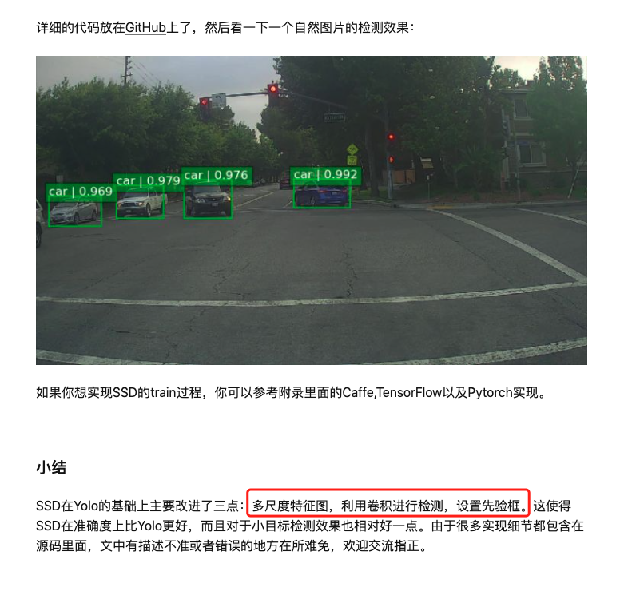

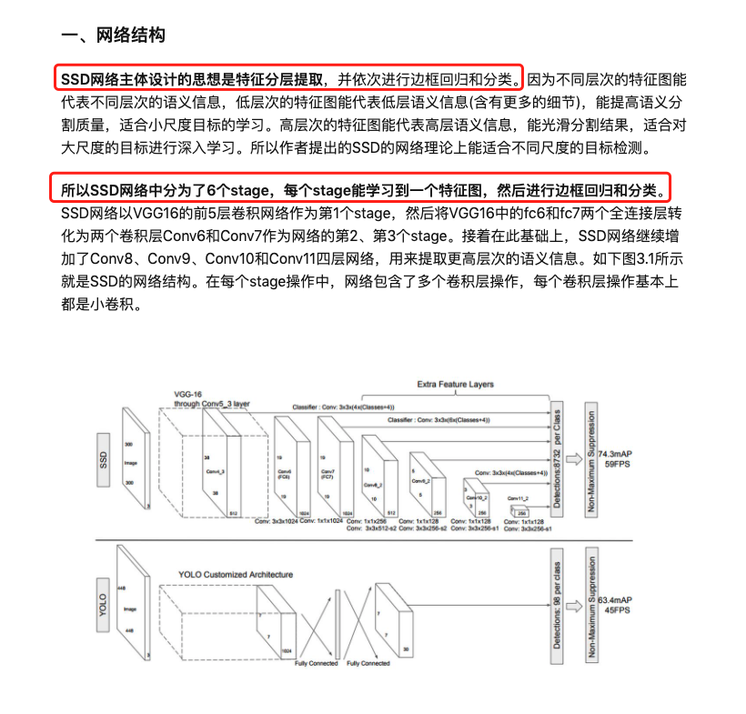
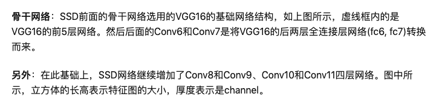
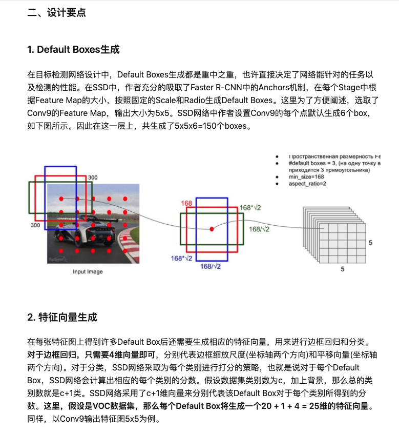
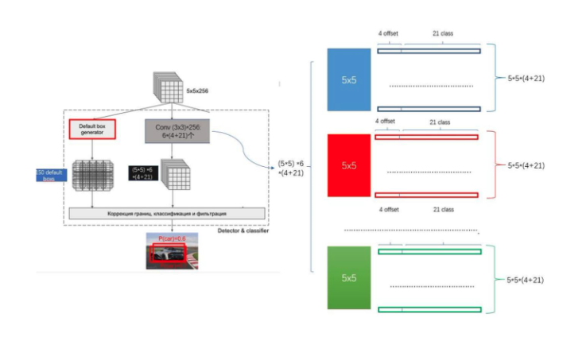
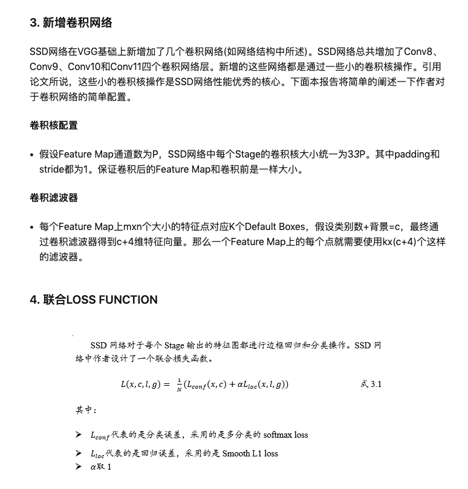
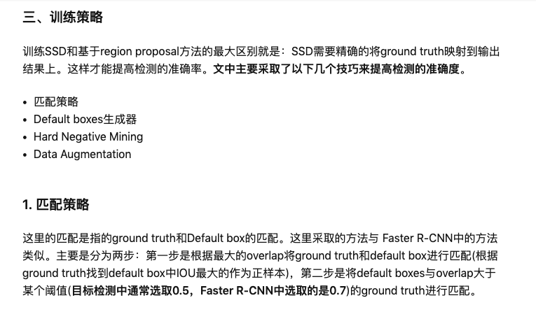
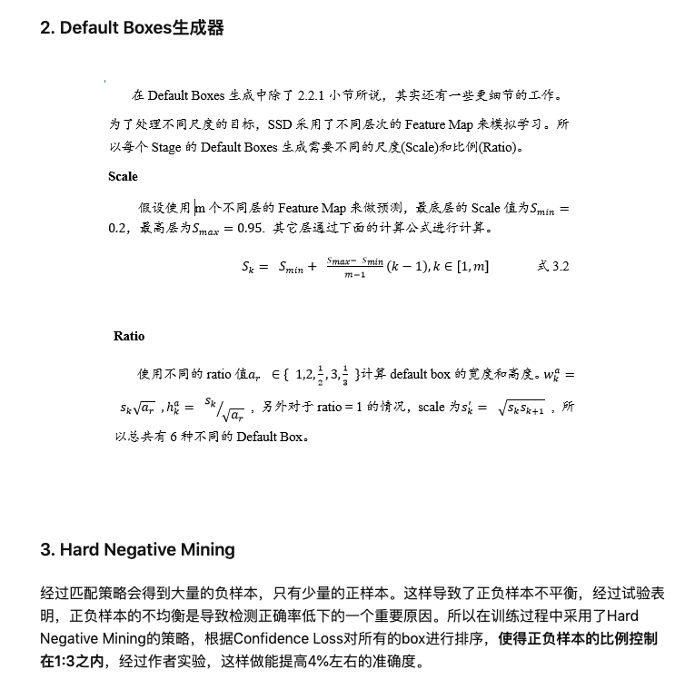
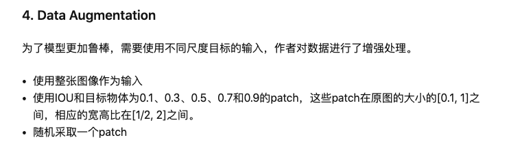

---------------

