### 数据结构 算法 之 Array

--------
#### C++ Array 操作及定义


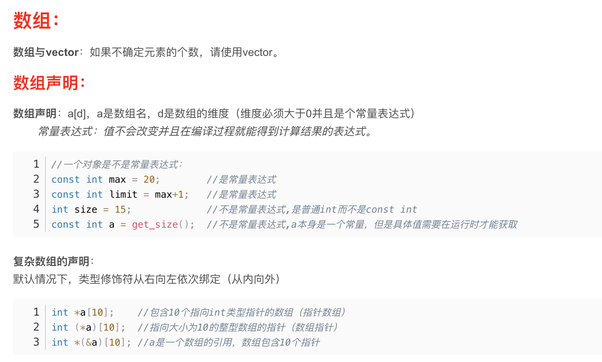
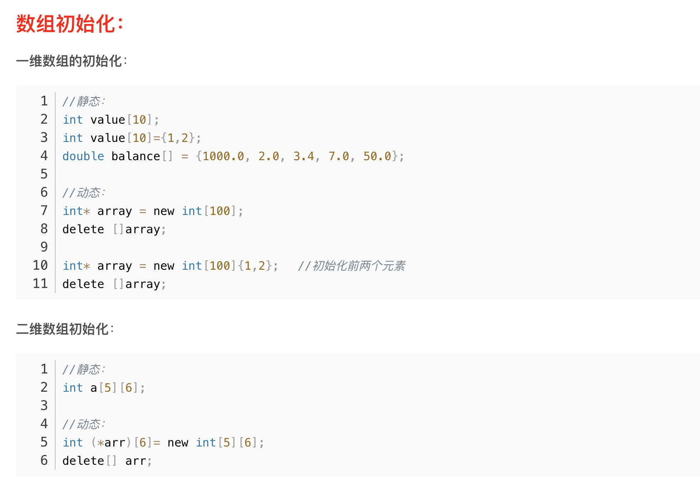
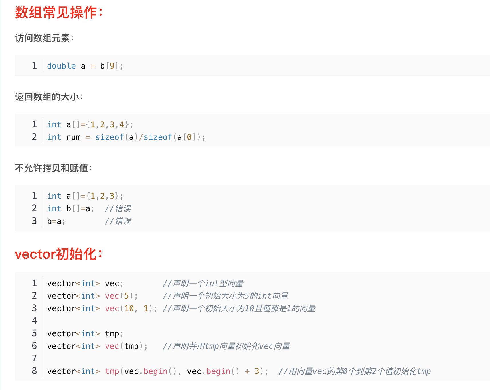
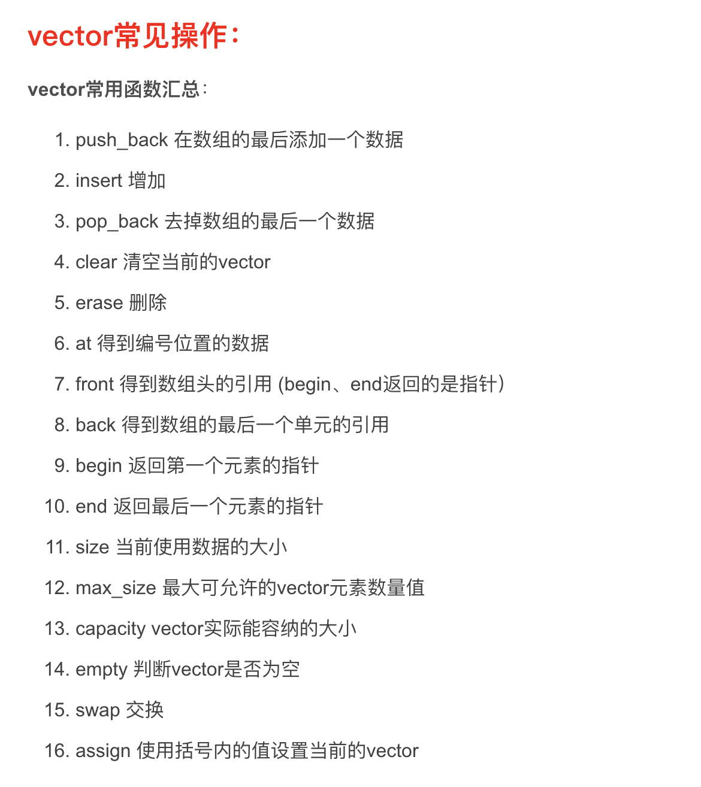
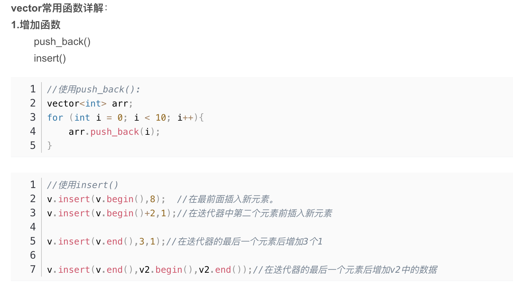
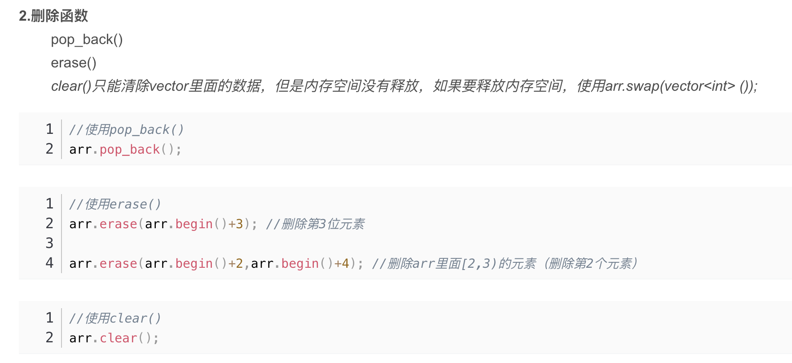
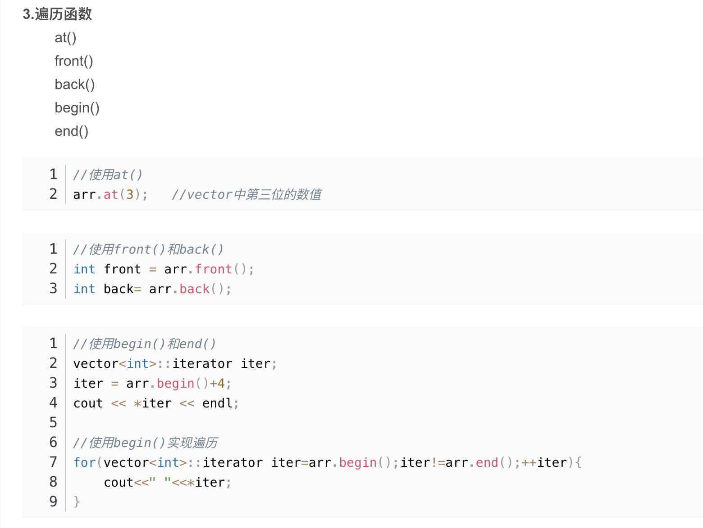
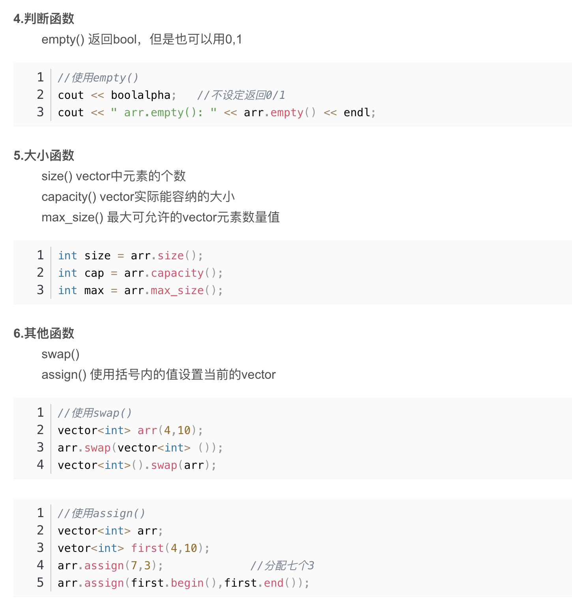

--------
#### Python Array 操作及定义

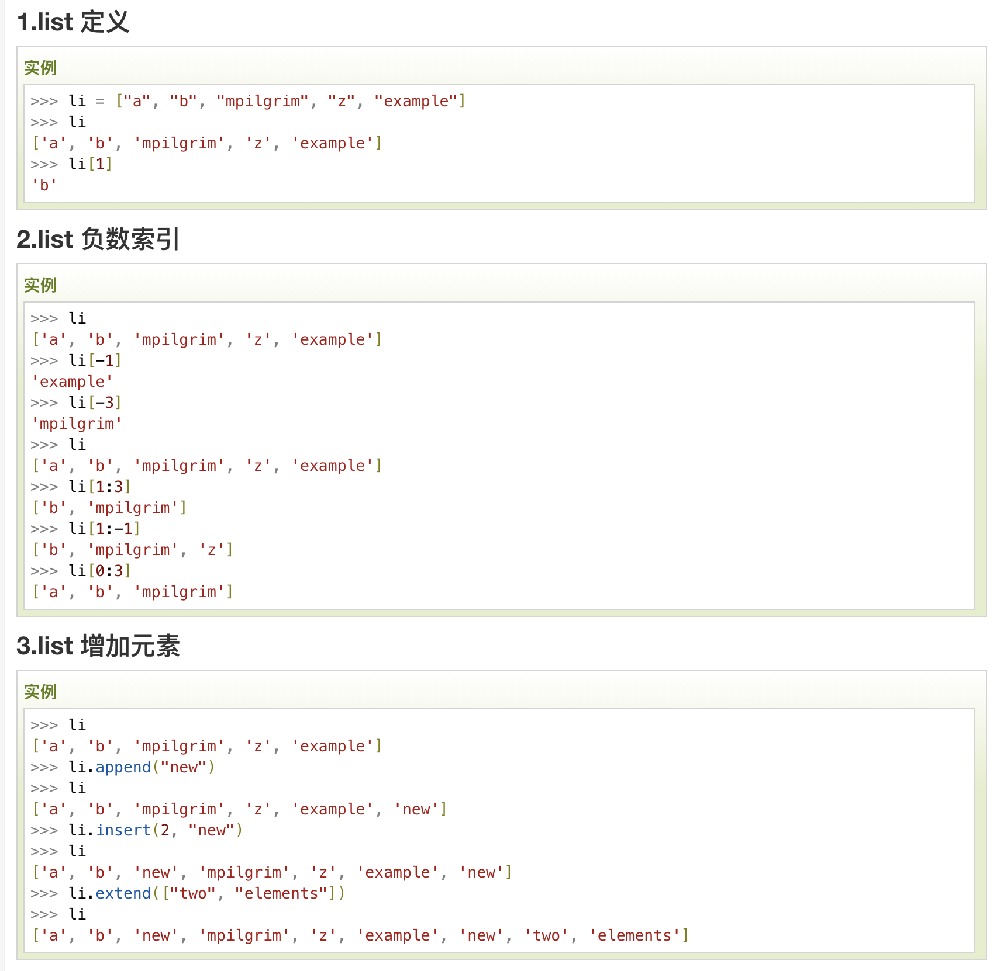
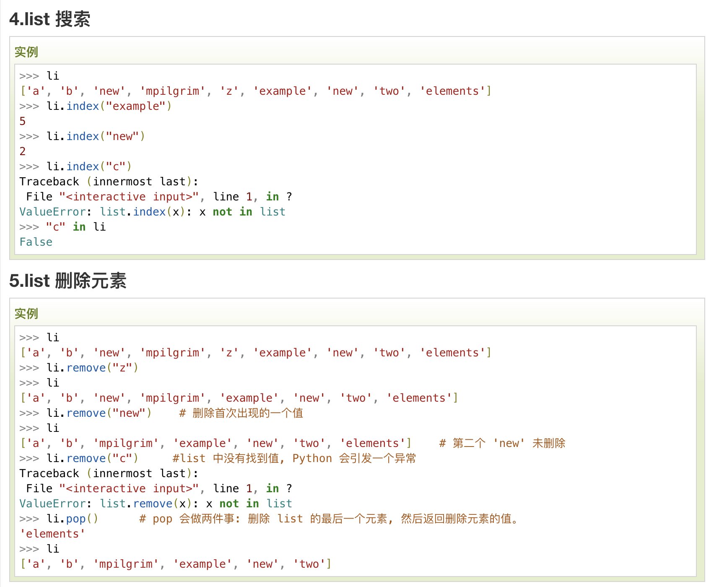
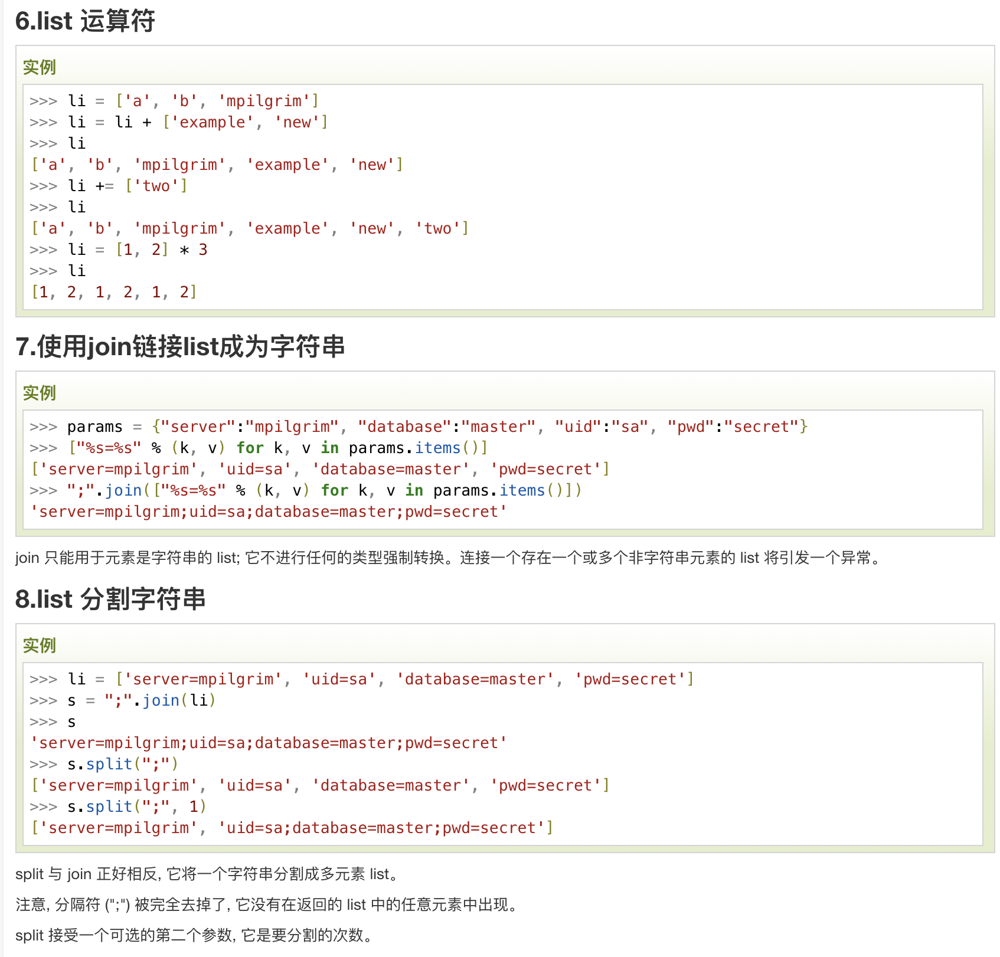
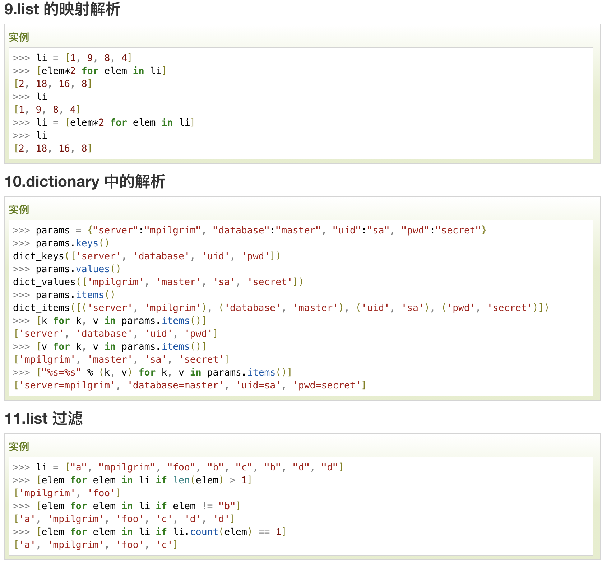

------------

### [LeetCode 4](https://leetcode.com/problems/median-of-two-sorted-arrays/)
 
    
解决方案：

##### 个人认为这个解决方案已经很高效了，或许还有更高效的
```python
class Solution:
    def findMedianSortedArrays(self, nums1: List[int], nums2: List[int]) -> float:
        # 此处 python 数组融合可以使用 + 完成
        num = nums1+nums2; 
        num.sort();
        lenth = len(num);
        if lenth % 2 == 0:
            return (float((num[int(lenth/2)]+num[int(lenth/2)-1]))/2)
        else:
            return (float(num[int(lenth/2)]))
```

##### C++
##### 时间是上面python的2/3，内存占用大概是上面Python的8倍，原因是使用Vector会占用大量空间
##### Vector 时间复杂度o(n)，可以用list,时间复杂度o(1)

```cpp
#include <iostream>
#include <vector>
#include <string>
#include <typeinfo>
#include <algorithm>
using namespace std;
class Solution {
public:
    double findMedianSortedArrays(vector<int>& nums1, vector<int>& nums2) {
        // Vector 的拼接，在 nums1 的后面拼接 nums2
        nums1.insert(nums1.end(),nums2.begin(),nums2.end()); 
        sort(nums1.begin(),nums1.end());
        int length = nums1.size();
        if (length%2 == 1){
            //cout<< " 单数 length/2 = " << length/2 <<endl;
            //cout << double(nums1[length/2]) << endl;
            return double(nums1[length/2]);
        } else{
            //cout<< " 双数 length/2 = " << length/2 <<endl;
            //cout << double(nums1[length/2]+nums1[length/2-1])/2 << endl;
            return double(nums1[length/2]+nums1[length/2-1])/2;
        }
    }
};
```

##### C 的一个实现，主要是使用数组完成

```cpp
void sort(float *a,int len){
    int temp;
    int i,j;
    for(i = 0; i <len; i++) {
        for (j = 0; j< len; j++)
            if (a[j] > a[i]) {
                temp = a[i];
                a[i] = a[j];
                a[j] = temp;
            }
    }
}
double findMedianSortedArrays(int* nums1, int nums1Size, int* nums2, int nums2Size){
    int length1 = nums1Size;
    int length2 = nums2Size;
    int new_length = length1+length2;
    float new_array[new_length];
    for (int i = 0; i < length1; ++i) {
        new_array[i] = nums1[i];
    }
    for (int i = length1, j = 0; j < length2; ++i, ++j) {
        new_array[i] = nums2[j];
    }
    sort(new_array,new_length);
    if (new_length%2 == 1){
        return new_array[new_length/2];
    } else{
        return (new_array[new_length/2]+new_array[new_length/2-1])/2;
    }
}
```


