## 哈希表
------

哈希表（Hash Table，也叫散列表），是根据关键码值 (Key-Value) 而直接进行访问的数据结构。也就是说，它通过把关键码值映射到表中一个位置来访问记录，以加快查找的速度。哈希表的实现主要需要解决两个问题，哈希函数和冲突解决。

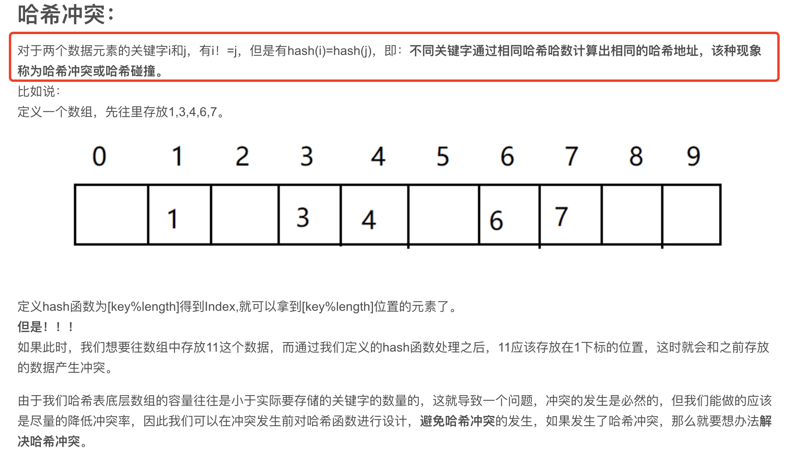
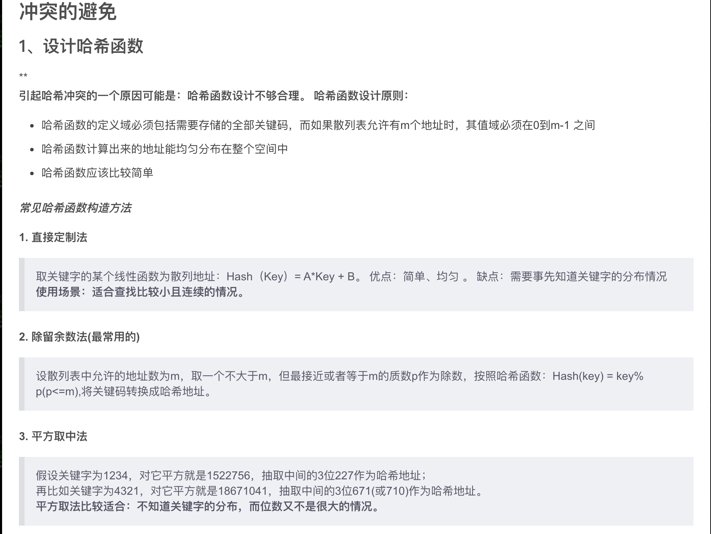
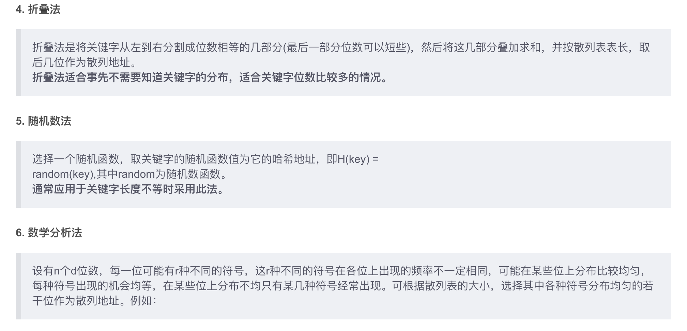
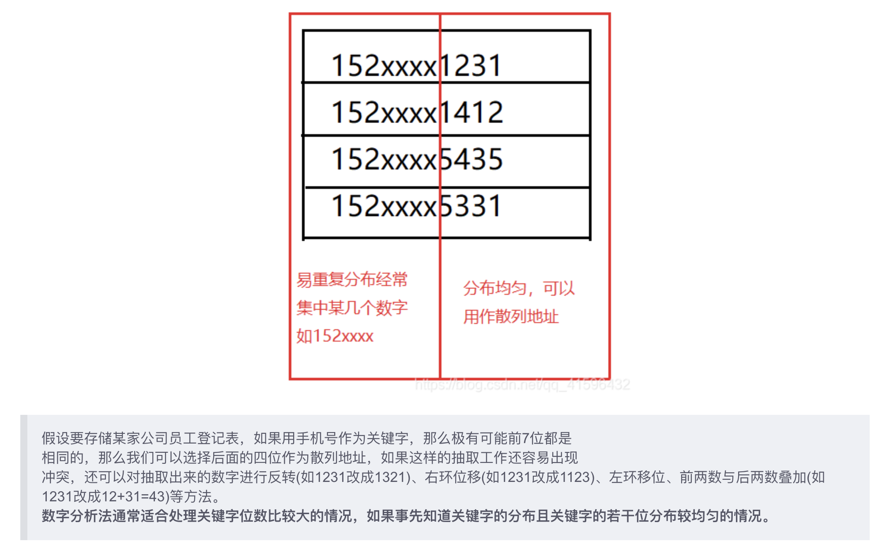
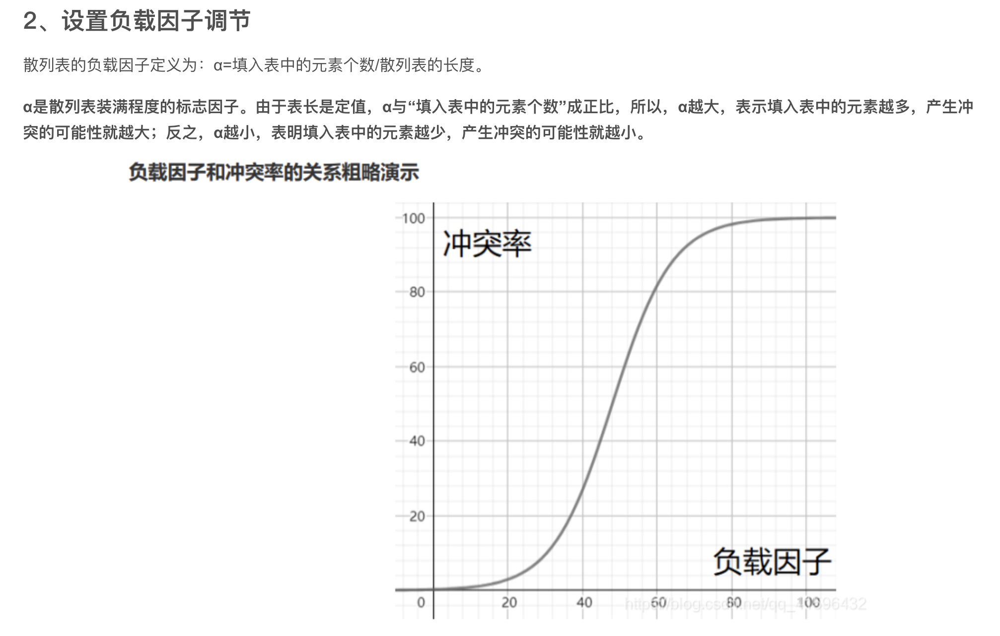
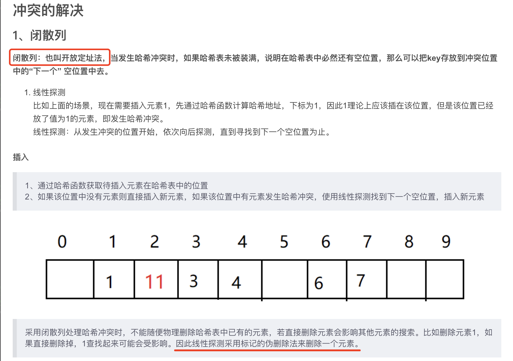
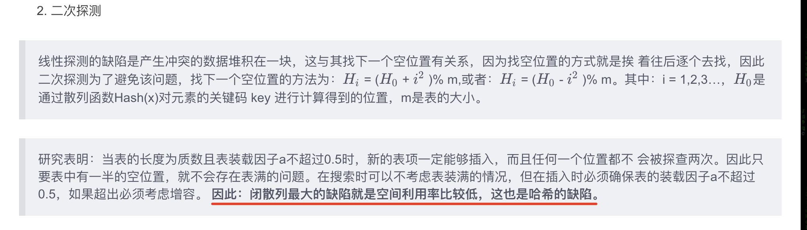
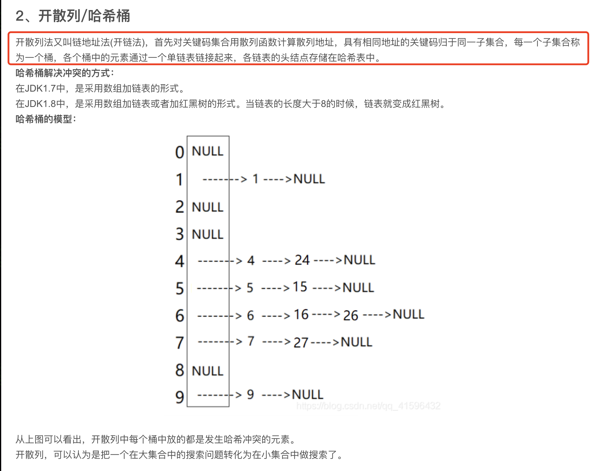
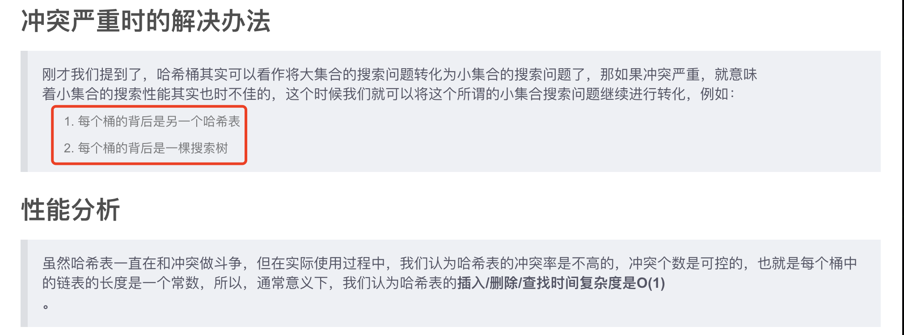
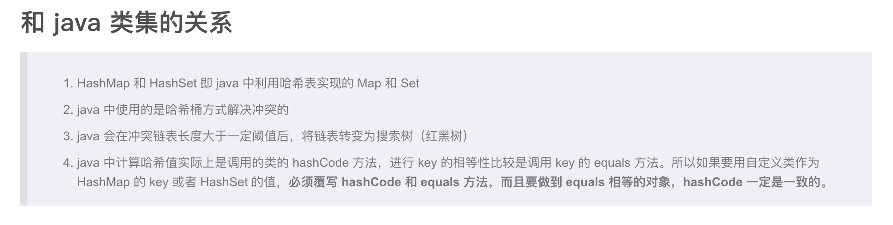


------


C++ 中的实现：
C++ 中涉及哈希表的算法，通常使用 map 或 unordered_map 实现。
unordered_map的底层是一个防冗余的哈希表（开链法避免地址冲突）。unordered_map的key需要定义hash_value函数并且重载operator ==。
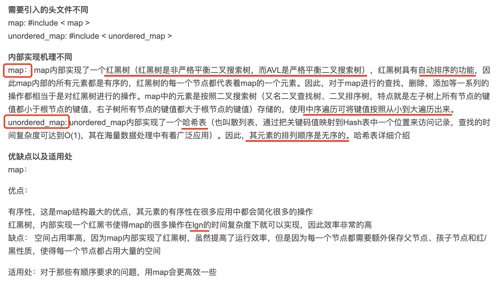
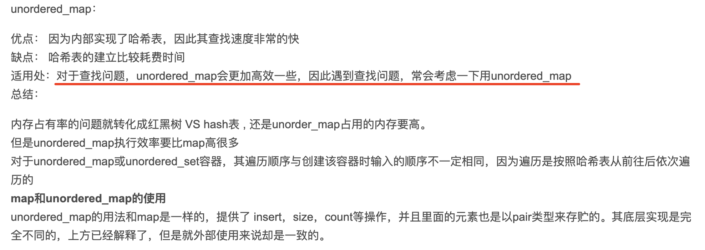
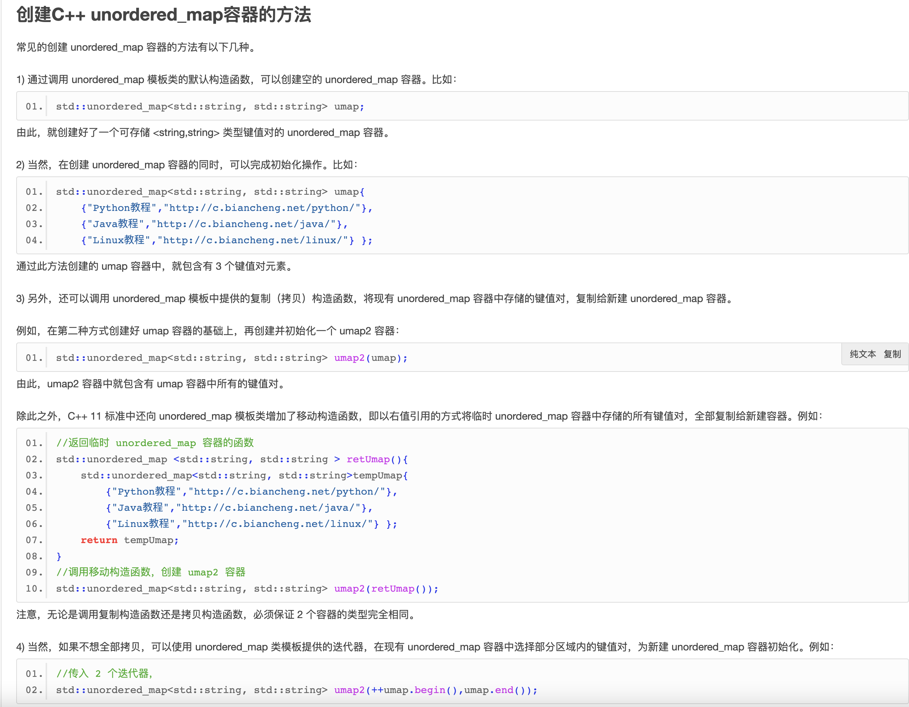
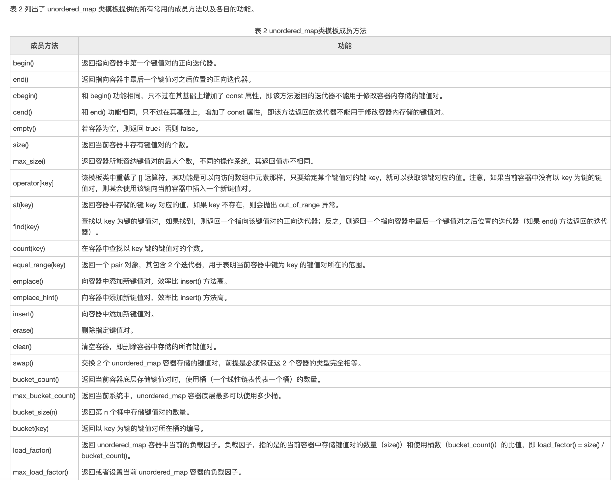
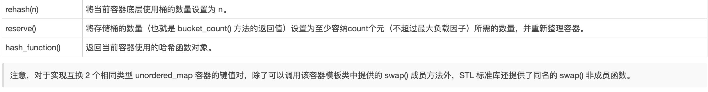


------
[LeetCode 30](https://leetcode.com/problems/substring-with-concatenation-of-all-words/)

一个不成熟的思路，找出 words 在 s 中所有的出现次数，再判断出现次数和 words 的长度，如果绝对值等于 words 的长度，则认定 words 中的词相连，但问题是，如果 words 中的词多于 3 个，则需要使用多维数组，且计算 words 中的词是否相连也很困难，因为相连的词位置可能会变。 此题最好的方法还是 哈希表。

```cpp
vector<int> findSubstring(string s, vector<string>& words) {
    vector<int> index;
    if (s.empty() || words.empty()) return index;
    unordered_map<string,int > m1; //words
    for(auto a : words){
        ++m1[a];
    }
    int n = words.size(), m = words[0].size();
    for (int i = 0; i <= (int)s.size() -m * n ; ++i) {
        int j=0;
        unordered_map<string,int > m2;
        for (j = 0; j < n; ++j) { // 检查三个 words 能否完全匹配
            string sub = s.substr(i + j * m, m);
            if (m1.find(sub) == m1.end()) break;
            ++m2[sub];
            if (m2[sub] > m1[sub]){break;}
        }
        if (j == n){
            index.push_back(i);
        }
        m2.clear(); // 清空map
    }
    return index;
}
```

--------


